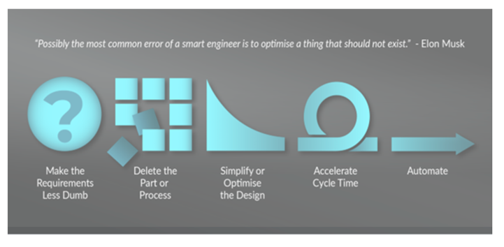

In today's fast-paced, hyper-connected world, the pressure to be productive is irrationally relentless. 

We are constantly reminded that productivity is the key to success -- that subsequently has been corrupted to believe that productivity is essential for survival and preservation. 

Many of us feel an overwhelming urge to engage in activities that we perceive as productive -- be it through social shame, keeping up with society, to avoid political conflict through GDP growth. 

<!--truncate-->

However, this desire and engagement for productivity cannot be fulfilled because there is a hidden consumer that is destroying a lot of wealth, leading to a lot of frustration for those trying to get ahead. 

The article intends to challenge the conventional wisdom that equates busyness with productivity and explore how many supposedly productive activities are, in fact, forms of consumption.

We will examine several examples, including the consumption of information, education, compliance, opportunities, and financial liquidity, to illustrate this point and encourage a reevaluation of what it truly means to be productive.

---

## Consumption of information
### News and market research
This is counterintuitive for most people to understand, especially when many were raised before the digital age where they still believed that studying and learning is productive. 

But one of the most pervasive forms of consumption masquerading as production today is the consumption of information. 

In the digital age, access to vast amounts of information has never been easier. We subscribe to newsletters, follow thought leaders, and engage in market research, often under the pretense of staying informed and making better decisions. 

However, literacy is no longer a problem today, rather its the distractions that is caused by generated noises. 

The reality is that much of the information we consume today does not translate into tangible productive outcomes. Instead, it often serves as a form of cultural capital, providing a sense of being "in the know" without yielding real value. 

How many of our LinkedIn doomscrolls translate into tangible career outcomes? 

How many of the news on Twitter written by "shiptalkers" ends up helping us make better crafts?  

How many equity research we read on SeekingAlpha, Substacks, and Medium translate into tangible trading signals? 

The world is full of informed people that can't produce great crafts. We have too many people falling for the [green-lumber fallacy](https://fs.blog/green-lumber-fallacy/).

This is not to say that information is not valuable, but when it becomes an end in itself rather than a means to an end, it is consumption. 

As a rule of thumb, if what you read ends up making "someone else richer" instead of "you getting richer", it is consumption.

The time spent consuming information could often be better spent on actual productive activity, such as doing hobbies, building relationships, friendships -- outcomes that typically emerge from "consumption leisure time". 

## Consumption of credentials
### Tertiary education
Another area where consumption masquerades as production is in the realm of tertiary education. 

Education is often seen as a productive pursuit, as it equips individuals with skills and knowledge that can enhance their productivity. This is mostly true only for STEM fields.

Even then many STEM jobs can still be taught to any curious mind and not exclusively reserved for those with expensive degrees. 

But as many people would have observed when attending colleges, the motivations behind pursuing higher education are not always altruistic or productive. In many cases, the drive to acquire degrees and certifications is driven by credentialism -- the demand for certified skills. 

Credentialism is a form of consumption, as it mandates a BS requirement that results in misaligned priority -- where the destructive motivation to acquire credentials hijacks the productive motivation to acquire useful skills or knowledge. 

Individuals who pursue education solely for the sake of credentials are not producing -- **they are submitting to an irrational demand for certification.**

This phenomenon not only distorts the purpose of education but also creates a mismatch between the skills individuals possess and the skills the market truly needs.

We are also discounting the problem where going to college "crowds-out" a person from participating 4 years of productive labor and being exposed to the competitiveness of market. 

### Coaching and online courses
Similar philosophy applies.

If what you are learning is not solving your problem, or if the problem it is solving is **less than the problem of your lack of credentials**, it is consumption. 

There is nothing wrong with learning more stuff and acquiring more cultural capital. But do not be fooled into thinking that is "productive". 

## Consumption of compliance and ego
### Management and bureaucracy

In a rational workplace, workers are hired to produce -- whether it's manufacturing goods, delivering services, creating research or content.
 
From my observation as well as many people's testimony, in many organizations the primary focus of work is less about production but rather compliance. 

**Many employees are hired not to do work, but to make someone else feel more powerful.**

On the first glance it is not that straightforward, as no one will admit this is the case. But looking at the quantitative results, earnings, and profitability, it immediately exposes the true motivations of some people. [^10]

[^10]: Pardon the sensitive example. It's like Hitler saying he is there to "win the war", but careful inspection will see that he is distracted by many campaigns of ethnic cleansing -- an irrationality not shared by leaders who are actually trying to win the war. 

Employees are expected to adhere to management structures, follow protocols, meet regulatory requirements. The most obvious examples being showing up to office 9-to-6, attending unnecessary meetings, requiring medical certification for absenteeism, and so on. 

I understand for many businesses, compliance is a necessary evil to preserve discipline and decorum. A business or team that lacks discipline is a slippery slope that quickly cascades to failure. [^1] [^2]

[^1]: Despite me practicing WFH most of my time, I would prefer not to if I can work with driven and competent people as the best creative work results from physical proximity. More importantly, juniors don't get left behind and actually stand a chance to learn and be promoted. WFH is very destructive for social mobility and I only anecdotally see it working for the privileged and driven, which I am very fortunate to be part of.

[^2]: I expect pushback from WFH advocates after all I said about dumb requirements. For work that is critical, physical proximity is essential. Most work are not critical, so WFH is still a net positive relative to showing up on office to satisfy a manager's desire for control.

While the origins of most protocols are well-intentioned, often they become bureaucratic exercises that consume time and resources without necessarily leading to more production -- more workers are hired ("productive") because more time of veterans has been spent on compliance ("consumption").

The economist's question is: "Before implementing any protocols, is all of the demand of compliance worth the cost?" 

For most bureaucracies, they are not financially constrained to contemplate if hiring for compliances counts as wastage, especially if the institution is financed through public investment and public debt. 

Many of them justify spending those cash on hiring people for compliances for a subset to feel more in control, often at the expense of shareholder's returns on equity or future taxpayers. [^3] [^4]

[^3]: Some bureaucracy's consumption for compliance has grown so serious to the point it has directly caused the collapse of birthrates, as many people are forced to be employed in BS roles and crowded out the time they could have spent on raising families.

[^4]: Basic intuition will refute that its the lack of money that is the core issue of declining birthrates. If the whole population is employed to upkeep a BS consumption (bureaucratic compliance), then all the salaries paid will still not afford a basic life as the cost of living will rise as fast as salaries getting paid. The net effect is shifting all the population's time from growing families to pushing papers in an office. We observe this happening in SK and JP, where employees make a lot of money by global standards but are not able to afford a basic life.

### Artistic perfectionism

Art, in its essence, is an act of creation -- a process that brings ideas to life and provides value to both the creator and the audience. 

However, perfectionism is an act of consumption masquerade as productivity, as it hinders the creation of value by postponing work, and often benefits no one except to feed the irrational ego of the artist.

It is difficult to draw a line between a productive desire (having high standards and to avoid redundant work later) and a consumption desire (to postpone shipping quality work to satisfy ego) since they both come from similar drive of "wanting to achieve more".

It is important to recognize when this drive becomes excessive -- where there is an endless cycle of refinement, spending over budget to tweak details that are imperceptible to others.

At the heart of artistic perfectionism is often the fear of not being good enough. This fear can manifest as an intense need for control and perfection, driving the artist to overwork their craft. 

While a certain level of ambition is healthy, when it becomes an obsession, any more "production" is quickly "consumed" by the ego -- no amount of productivity gains will result in growth if its all destroyed by the ego.

## Consumption of opportunities
### Non-merit-based advancement

The concept of opportunities is another area where consumption masquerades as production. 

Entrepreneurship and deregulation has a positive externality to the market that is unrecognized and undervalued in the sense that it creates opportunity for other people to create value. 

However, when opportunities are provided based on factors other than merit and wise risk-taking activity [^5], they can become a form of consumption rather than production. 

[^5]: A "wise" risk-taking action is when there is an asymmetrical upside relative to downside and does not outsource risk to the public. "Opportunities" financed by public-debt is not "wise" because it offloads downsides to the public. It is more correct to describe those debt-financed "opportunities" to be a consumption goods bought by "future taxpayers" -- depending on the outcome of those programs -- a positive ROI (scholarship) or a net value destruction (hiring  mascots to meet quotas).

Consider hiring quotas, DEI, and other forms of "opportunity supply" that appeals to identity (although anything that is non-merit-based would result in destructive outcomes). 

A naive person would think that these are a form of production, as they provide opportunities to people who would otherwise not get it under normal competitive scenarios. However, this deception can only fool those who cannot understand 2nd-order effects from such policies. 

For anyone who understands 2nd-order effects, **every non-merit-based opportunity supplied consumes the opportunity that would have otherwise been given to a more competitive person.** 

To measure the outcome of "who is the net consumer of opportunities", we can look at the "net opportunity created" by a non-merit person relative to a merit person. 

One might argue that an incompetent hire creates "more opportunities" as the problems and drama that come out of them means there is a demand for more people to come in and solve, whereas a competent hire does too much with too little, resulting in "creative destruction". Under "net employment" metrics this will be true. 

However, a person that creates drama for other people to cleanup means other people have less time for other productive pursuits. A person that does "creative destruction" means other people are liberated from monotonous tasks to pursue more challenging tasks. Numbers cannot decide who is a net producer or consumer of opportunities, but qualitatively we all can decide which one is more preferable. 

> "Got it, lets do merit-based by looking at resumes and credentials!"

If credentials are a signal to competence, then I'm sure many people wouldn't have any disagreements. That said, from our [previous session](illusion-of-productivity#consumption-of-credentials) and from this [article](/blog/how-to-steal-from-the-public/#human-resources-and-recruiting-industry), I have expressed low confidence to those signals as they had suffered from [Goodhart's Law](https://www.lesswrong.com/w/goodhart-s-law) and perverse incentives by the recruiting industry. 

### ESG investments
If financial market is a form of resource allocation, then it constitutes a distributor of opportunities. 

Under basic rules of financial markets, the most worthy business to obtain capital should be the one that creates the greatest shareholder return, IE: the highest ROI, ROC, ROE, or ROA. The rationale being that the generated value will be returned to shareholders as dividends, and investors will use those dividends to pursue more productive market opportunities. 

However, due to the considerations of positive and negative externalities (eg: dirty mining companies, labor exploitative companies taking too much public capital), ESG investments are created to redirect capital to businesses with expectation that those business generate enough positive externaties to lift the rest of the market. 

That said, we have given ESG investments enough time and the results haven't been promising. From valuation and profitability standpoint, many companies from ESG portfolios underperformed the general market (less profitable, higher price/earnings, lower yields). 

Even the label "ESG" is not a reliable signal to measure the quality of a company pursuing socially beneficial goals. XOM -- an oil and gas company has a better CDP score than TSLA -- an electric car and robotics company. 

The classification of what constitutes an ESG company is opaque, undemocratic, and seems to correlated with financial spending on ESG consultants and compliance. 

Many companies that try to get an ESG certification do so not for the benefit of consumers, or even for the benefit of shareholders [^6]. Rather, its to conform to the "consumption of credentials" highlighted earlier. 

[^6]: If ESG really does benefit shareholders, the company would be more profitable, result in better valuation or growth after the certification. Instead, many of the returns generated post-certification are "circular" (IE: more capital raised from ESG funds that result in more expensive valuation but not profitability), or the "profitability" are revenue derived from government subsidy programs that taxes future public. 

## Consumption of liquidity
### Trading and financial speculation

In the financial world, trading often feels like a productive activity because it involves doing "productive information acquisition" and making decisions. However, much of the trading that occurs in financial markets is actually a form of consumption. 

Retail investors and traders frequently buy and sell assets without a clear rationale, often driven by emotions, speculation, or simply the desire to participate in the market. 

If these activities do not yield better returns on a market-risk-adjusted basis, arguably they are simply consuming liquidity. 

Financial advisors often warn against frequent trading for this reason, yet many trading platforms and market makers encourage it, as they have a vested interest in selling liquidity. 

### Trading labor, patents, companies
On a more micro level, we can apply the same principles to labor markets, patents, and companies. 

An employee that frequently looks for new jobs, changes jobs -- can be considered a productive activity if they are actively discovering information that helps their career progression that subsequently returns more value downstream from their new role. 

However, the act of scouting also crowds out the productive activity of working hard and staying committed to the company. In effect, the relentless scouting consumes liquidity from the labor market by flooding recruiters with more data points to compete for a limited role. 

Likewise, the same effect can be observed by recruiters who are constantly looking for new hires instead of creating incentives for existing employees to stay or be promoted. 

A labor market with high turnover means lots of transaction costs involved, not to mention the cost of retraining new hires and the loss of productive momentum. 

When you observe the market having a trend of greater spending in recruitment, shallow thinkers will mistakenly believe that the labor market is growing and subsequently a signal of a more productive economy. 

Those who contemplate will realize it is the result of **more liquidity consumers as a response** to an increasingly inefficient market [^7]. 

[^7]: The inefficient labor market can be caused by numerous reasons. Having dumb requirements and credentialism is one explanation. Having a high turnover rate is another. I'll be generous and think it has more to do with jobs getting more complex. When jobs are complex, it raises the transaction friction, which means the act of consuming liquidity is more costly.

### Dating and romantic relationships 
Having higher expectations from prospective partners raises the bar for the quality of the relationship. 

More people trying to meet this demand can be considered "productive" if they end up raising their own value in earnings, reputation, and social capital for their partners.

In practice, this is not what we observe. The explosion of choices means people are less commited, more choices, and subsequently more "liquidity consumers".

When people are busy spending time and money impressing the irrational public for the chance of companionship, it crowds out the productive activity of building a relationship that would have otherwise happened between two committed couples.

---

## Anatomy of production and consumption
While I have given a lot of examples of net consumption activities masquerading as production, we can reduce the concept to a simple factor. 

>**If it has a dumb requirement, it is probably a consumption.**

**No amount of increased productivity will satisfy a dumb requirement, and the result will still be a stagnation of progress.**

In effect, doing the wrong thing is no better than not producing anything.

---

