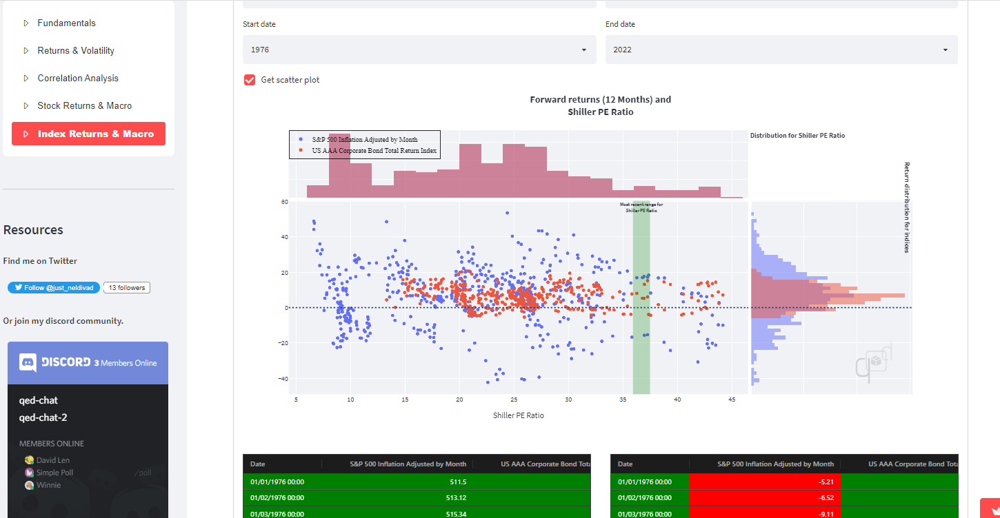
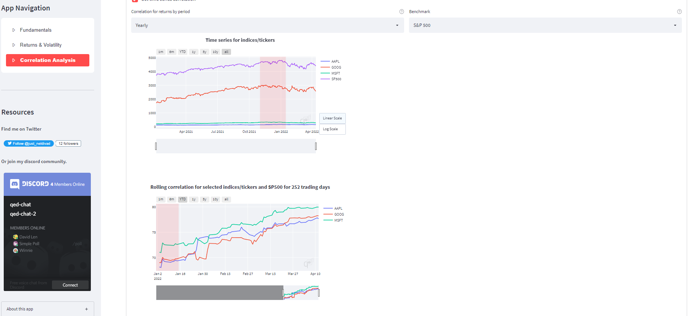
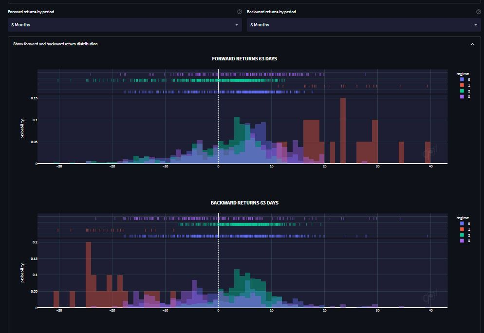
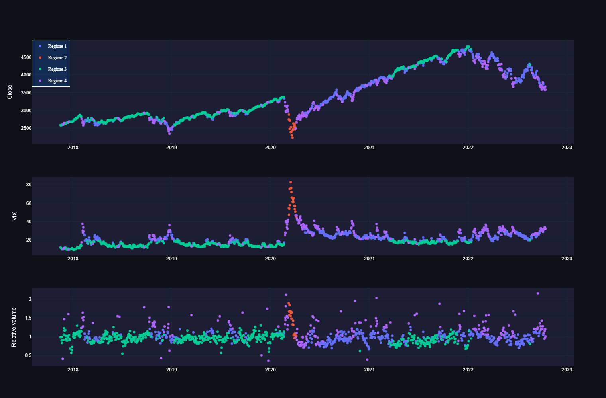

import React from 'react';
import ReactPlayer from 'react-player';

This is a story I rarely share with anyone. But a lot of my problems are shared by other people and I wish more could come to understand the problems we have today.  

<!-- truncate -->

## My history
Money has always been a problem for me since young. My parents are either dead or sick and I have to work a lot to support myself. It is also how I got the obsession in finance. 

I majored in econometrics, thinking it will land me a job in finance. It didn't happen [^1].  

I ended up working for [a Youtuber](https://www.youtube.com/@TickerSymbolYOU), built a quantitative trading research site that helped me understand markets and manage my own assets, built and sold multiple softwares for different companies.

[^1]: COVID happened, suddenly there is a hiring freeze and I lost all contacts that could land me a role in banking. I had to rebuild my life from scratch and that got me to code and write music.

Preview of work I did in my quantitative research on micro

Preview of work I did in my quantitative research on macro

Nothing is easy, but doing the hard things exposes me to understanding the world better. 

I want to do more, I respect others who can do more, and I want to help those who want to do. That said, it seems like things are getting more unfair for those who do [^2] and I need to start standing up for them.

[^2]: Nothing is fair and people often advised that I should be taking advantage of those signals instead of exposing them to really make change. I don't care about ROI. I just think its important for people who want to understand to hear what I have to share. 

I've attempted to explain some of those problems like [bureacracy](../02-19-how-to-steal-from-the-young/index.md) and [debt-financed opportunities](../01-05-we-cant-afford-job-security.md) in some of my post. I think its unproductive to fight against other people and more productive to understand how the system we are working for sometimes fails to work for us. 

I hope with my history and things I've worked on, I can convince you that I understand enough about money and macroeconomics to tell you what works and what doesn't, not just on an individual level, but also on a social level. 

---

## The illusion of financial freedom
For decades, financial independence has been touted as the golden ticket to a life free from the drudgery of soul-crushing jobs [^3].

[^3]: That I seriously don't believe it needs to be done. Many "soul-crushing" jobs have no reason to be there, other than it being a product of "debt-financed opportunities". Basically the CB prints money to employ people doing BS jobs, basically a form of "UBI" with extra steps. All the money you gain, you lose it to rising cost of living (because people who actually made products to lower CoL had been stolen to work for the bureacracy), to taxes, to inflation, to having less time to do other things. 

Financial independence can only be realized by the mechanism "compound interest" -- a force that makes your money grow exponentially. On paper, it's simple: you save enough money, invest in assets that yield returns, and watch your wealth snowball until you can finally retire. 

It's as braindead as planting a seed that grows into a money tree, providing shade for you while you lounge all day.

Compound interest works by reinvesting your earnings so that future growth is based on both your initial capital and the accumulated returns. Financial influencers often paint a picture of an exponential curve. Advisors often tell people to start early and young and you will be 10x riicher than those who started 10 years later. 

> "Compound interest is the 8th wonder of the world. He who understands it, earns it. He who doesn't pays it." - (Presumably) Albert Einstein.

There are many wrongs with this logic. 
1. This assumes that everyone can keep investing consistently for a lifetime.
2. This assumes that everyone will never run into any emergency situation or unexpected event that will force them to stop investing.
3. This assumes that your buying power in the future will be the same as your buying power in the past.
4. I've written an article with 100k views [showing how it can't be done for everyone](https://medium.com/datadriveninvestor/facts-about-financial-independence-no-one-talks-about-3835291539f3) (although now I explore more implication of the compound interest mechanism so its not a direct copy)

Someone tried explaining the whole thing in 20 minutes that does fit a lot with what I know. The rest of the article will have similar takeaways of the video, more detailed explanation of the compound interest mechanism, as well as my anecdotal experiences with working class and investor class. 

<ReactPlayer
  url='https://www.youtube.com/watch?v=IwEVYlkopTY'
  controls
  width='100%'
/>

---

## Compound interest (they don't tell you)
### Lifecycle conundrum
Most people have only a limited window during which they can work, save, and invest. Students spend years building skills while incurring expenses, and retirees often face high living costs without any income. This means that the full power of compounding is never truly realized on an individual level. 

For an average person [^4], you start saving at 30, get compounding work for you from 30-60, and pray that your compounded value can support you post-60 plus your children's pre-30. 

[^4]: It's not even average. That's also assuming you don't do stupid stuff like getting into drugs, credit card debts. Or suffer from shocks like layoffs, health emergency, family death, divorces, unlucky childbirth, etc.

For compound interest to really work like the guru's story, you have to born rich, be a trustfund baby, spend as little expense on assets [^5]. Then, you start compounding as soon as you get access to a bank account at 18 and compound all the way to retirement.

[^5]: Like living in your parent's house, borrowing someone's car, borrow everything you can from other people. There is no shame. You are just getting the most out of compound interest.

### How does compound interest even get paid? 
#### Active compound interest
Compound interest is not a scam. 

In economics, maybe you start with an empty land. 

First, you dig trenches. The "compound interest" is that its easier for you to fill up water and build a farm later. With a farm, the "compound interest" is the increased population in your land. With more population, the "compound interest" is more work getting done. 

In a software example, you write a package. The "compound interest" is that package gets used in multiple microservices. With multiple microservices, the "compound interest" is apps with more functionalities. With more apps, the "compound interest" is more data was created. Data is the "compound interest" machine learning models. ML models is the "compound interest" of faster software development. 

These are "active compound interests" in the sense that it's "paid" to you by letting you working on the next thing the new door has opened. 

But what most of us are interested in is "passive compound interest". 

How are you going to pay for that? 

#### Passive compound interest
The same way its going to be paid like an active compound interest. You invest in "shovels" that let people "pick gold". Then, people give back some gold to you so you can buy more shovels to rent to other people. 

There are a few problems: 
1. You will run out of people who want to pick gold.
2. Not everyone can be the guy owning shovels!

When you invest in a company, its profits (aka your returns) stem from the efforts of countless employees. If everyone were to retire early, who would do the work to keep the pie baking?

This imbalance reveals a critical flaw: the dream of universal financial freedom and infinite compound interest is built on an unsustainable model. 

When asset returns depend on the continuous labor of a relatively smaller group, widespread early retirement becomes a pipe dream. The returns compound because someone is still working hard, not because the system is magically self-sustaining. 

---

## When passive compound interest is too much
Hopefully you understood the difference between active compound interest and passive compound interest, and I've shown you that there is a limit to passive compound interest -- the exponential growth of compound interest either does not happen, or the workers using your asset must be exponentially productive. 

In both cases, this did not happen in real life. 

Real economy did not grow as fast as asset price -- IE: workers did not get productive faster than the returns of asset owners. 

What happens when the growth of shovel owners rents increases faster than the rate of gold picked? 

### Passive compound interest eventually captures ownership from the worker
Many people really got rich doing nothing but owning. It's not necessarily a bad thing as they do assume risks of owning [^6] (which we may argue if its actually active compounding and not passive compounding).

[^6]: Most homeowners make less than you think. They make money by renting more than their installment payments. But houses needs repairs and its not uncommon for a single repair to set back the owner by few years worth of rental income. This also discounts the risk of vacancy, unlawful tenant, fires, theft, vandalism. Sure, they build equity while doing so. If the cost of owning is less than what they would have spent on rent, or if it is less than the price appreciation, they are "winning" the market. What happens when house prices decreases (like most of non-owners wish to happen)?

However, the problem is now the ROI for asset owners outpaces the ROI of the worker (real GDP growth). 

This has at least 3 consequences:
1. Workers have less purchasing power to be a consumer in alternative investments / economies. 
2. More workers quit picking gold and move on to owning shovels. 
3. Workers that can't own shovels will work harder to get ahead, essentially getting squeezed out of the market in the long term.

From the video shared above, what the author realized is that his ventures that depended on the consumers buying power (restaurants) didn't turn out as well as simply owning assets like gold, stocks, or property. 

> If you allow the rich to grow and grow, once you hit your natural limits, the rich will continue to grow by basically cannibalising the existing middle class.
And that's not because they're evil. It's simply because their wealth is so large and grows so quickly and there are so few actual real investment opportunities that basically they have no other option.

---
## Anecdotes 
In hindsight, many active choices had been worse than passive choices. 

Disclaimer: The past is not a prediction of the future. What worked before will not continue working in the future. Do not use these anecdotes to decide your future. It is here to show you problems of the economy for the last few decades that led to the profitability / unprofitability of some decisions. 

### Dropshipping and Adsense
In 2001-2010, I remembered the gold rush in the internet economy of dropshipping and creating and blog and financing it with Adsense. 

As a teen with money problems and desperation, these are the labor I subscribed heavily into. I spent money on courses, domains, built my own projects, tried selling, made a lot of mistakes. 

It's not unprofitable, so naturally it starts inviting a lot of competitors that dilutes the returns. 

With hindsight, engaging in the gold rush might not be the best move. I should have just bought the stocks of AMZN and GOOG and the risk-adjusted ROI is much higher than competing heavily in dropshipping and Adsense. 

### Games and coin mining
Game development is challenging. Its more hardware demanding than other industries, so you have many developers trying to optimize code to fit in the hardware requirements. 

Bitcoin mining also had the same problem, and it turns out there exist a company that specialized in solving these niche computing requirements -- Nvidia. 

Again, in hindsight the average game developer and bitcoin miner should quit early and buy Nvidia stock.

This is a guy who tried starting his own company that ended up failing and got into a situation where many would not expect someone of his position to be. 

<ReactPlayer
  url='https://www.youtube.com/watch?v=tVz_hf4Jbe0'
  controls
  width='100%'
/>

From Robert: 

> It's easy to give advice about what to do if you could go back into the world of 10 years ago, but your life is not going to start 10 years in the past and the conditions of the world today are completely different. If I was able to rewind the clock and go back to working at Amazon or Nvidia directly after graduation I could have been a millionaire by now $20,000 worth of Nidia stock options from 2014 would be worth about $5 million today. 

> But then again most of the money would have come from the appreciation of the company stock not from the salary of actually working there. So the best strategy would have been to just get a student loan and spend all of it on Nvidia stock and then go sit on the beach for the 5 years that I spent in school and the 10 years that I spent trying to start a business.

Incidentally, I happen to know a speculative guy in college who did just that and is doing way better than every person I know from my cohort. 

### College and work
Speaking of college, I find myself agreeing to Robert. In my experience, my time and money in university has not justified its ROI -- I would been 10x wealthier today had I just invested all of my tuition fees into SP500 and used those 4 years working for minimum wage. 

Likewise, trying hard to get my first job in my country also did not justify the ROI. The income I make (RM3000 as fresh graduate) [^7] barely covers the cost of living, travel, and food I need to work. 

[^7]: Malaysian wage offers are pathetic. After adjusting for tuition fees and national wages, Malaysia ends up as [top 5 most expensive country for university education](https://www.weforum.org/stories/2015/10/the-11-most-expensive-countries-for-a-university-degree/). So much talent (including me) refusing to work locally for this reason. I think the lowball offers are consequence of the bureaucracy and commercial culture -- hard to apply for a job, hard to hire someone with all the paperworks, hard to raise money because every investor just buys real estate (Malaysia tax and laws doesn't benefit equity as much as real estate). I don't want to deal with any of this and I just work with anyone who DMs me on Discord. 

Even my own experience shows that an average startup / business often yields lower returns than simply investing in the stocks of established companies like those of their vendors like Cloudflare, Adobe, Amazon, Avid. 

Again, past returns are not future expected returns. Do not use this information to make decisions for yourself.

---
## The social trade-off of financial freedom

At its core, the promise of compound interest -- and by extension, early retirement -- is a double-edged sword. The system only works if the working class continues to toil, fueling the growth and profits that asset owners enjoy. 

If everyone were to chase financial independence by retiring early, there is no labor to sustain the economic engine. If you want workers, but you also want compound interest, it means you have to squeeze the working class out of ownership and opportunity.

When working class is squeezed, you will see consumption markets to underperform the general market -- restaurants, videogames, music, movies, content, etc. are unprofitable because no one has any money to spend -- it is going to come and bite back the owner's interest.

Printing money and paying people money to work in a bureaucracy is also not sustainable [^8] -- all you're doing is increasing the cost of living, delaying the pain, while also decaying your population to do stupid stuff over more productive things (like starting families) during their most productive years until they become old, useless, and poor. 

[^8]: I'll argue that the lack of sound money, a centralized currency that can be manipulated and artificially push people into pointless labor is the source of all problems. 

## Real compound interest is active compound interest
True financial independence isn't about chasing an ever-expanding line on a graph. It's about living within your means and acknowledging the limits of our economic system. 

While early retirement is possible for some, it often comes at the cost of increased social inequality. The pursuit of "passive income" is a seductive myth -- each "passive dollar" comes from someone else's hard work.

The real compound interest is the doors you or other people's asset has opened to you.

With AI, a working class get to make use of so many people's data, algorithms and create things millionaires from 10 years ago couldn't. 

That said, the owner class needs more critical examination. At some point, passive compound interest becomes unfair and social cohesion will decay. It is also in the owner's interest [^9] to ensure that the working class is not squeezed out of the economy so that they can continue to work and create value.

[^9]: Anyone who owns SP500, has retirement savings, has a house is an owner. It's not just the top 1% that is the owner. 

If its really hard to agree on how much compound interest owners should get, maybe the simpler way to grow is to just get rid of bureaucrats. Seriously, why do you need people stopping other people from working?

---