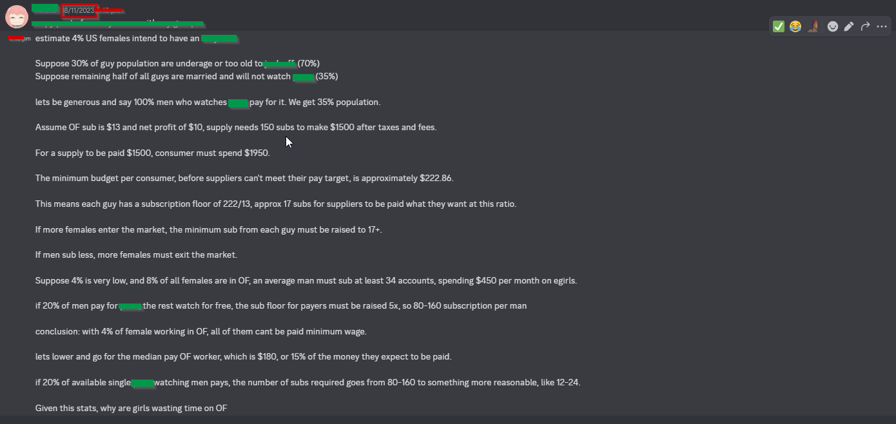

At the end of 2023, I was autistic enough to count the stats of a popular career choice of a demographic. It was just a fun hobby I did with my friends. 

<!--truncate-->
<details>
<summary>Screenshot</summary>

</details>

## Math time

### Context
- Estimate 4% US girls intend to have OF 
- TAM for OF is 35% population 
- Suppose OF sub cost $13, net profit $10, someone needs 150 subs to make minimum wage. 
- For an OF model to be paid $1500, spending from consumers would be $1950. 

**Girl side:**
- 4% of 165M, 6.6M OF accounts 

**Guy side**:
- 50% of 330M, 165M males (gender match)
- 70% of 165M, 115.5M males (age-appropriate)
- 50% of 115.5M, 57.75M males (unmarried)

**Minimum spend per guy for all accounts to hit national minimum wage:**
```math
(6600000 * $1950) / 57750000 = $222.86
```
If every sub is $13, and the mininum budget for each guy is $222.86, then they only have enough to let 17 accounts get paid minimum wage. 

---

## Non-equilibrium
- If more accounts get created, the minimum sub from each guy must be 17+ 
- If men sub less, more accounts must exit. 

### Scenario 1 (More girls)
Suppose 8% of the population is going to have OF, from 4%. Minimum sub or spend must double -- 34 subs, or $450 spend per guy. 

### Scenario 2 (Realistic)
Sad truth. Not all guys pay. If only 20% of them pay, then the subfloor for payers by raise 5X, `17*5=80` subs. 

---

## Conclusion:
With 4% girls in OF, all of them can't make minimum wage. In fact, the median earnings is $180 [^1]. 

[^1]: Insider numbers from 2022. 

Using median earnings, and 20% paying users, subfloor goes from 80 to something more realistic to what I personally know [^2] -- 12 subs. 

[^2]: I mean, who doesn't personally have a friend who pays for OF? Um...

Given this depressing stats, my encouragement at 2023 for young women is to not start an OF account, as it pays less than minimum wage and you have pics inside creepy dude's computer for life. 

---
### Fast forward to 2025
Someone did the actual math on OF accounts. 

https://x.com/HarmlessYardDog/status/1909613773666549902

The final number comes to 8% -- 2X my estimation. I don't know if I should be proud of how generous I am, or be ashamed of how wrong I am.

Either everyone is making less money than my predictions, or guys are spending more than I thought ($222 - $1110 per guy already looks a lot to me, and now we are to double that?). 

Have fun with the stats. 

Nerd out. 

---
