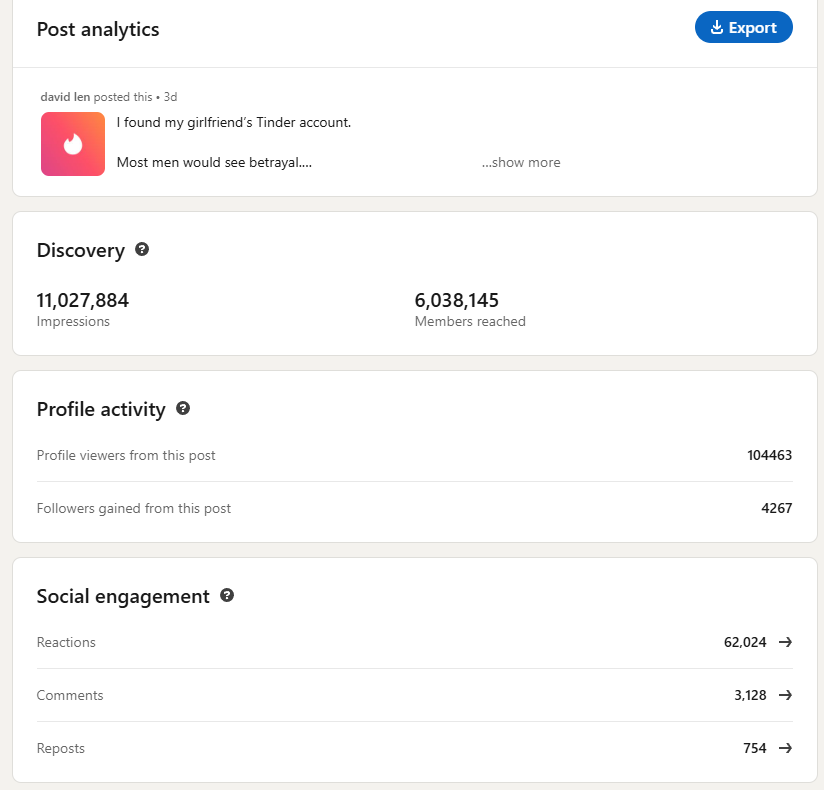
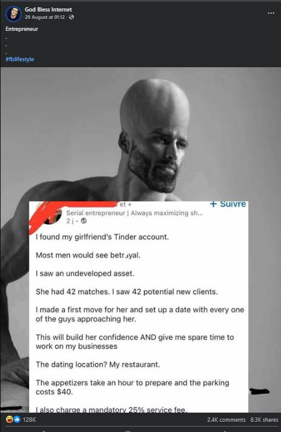
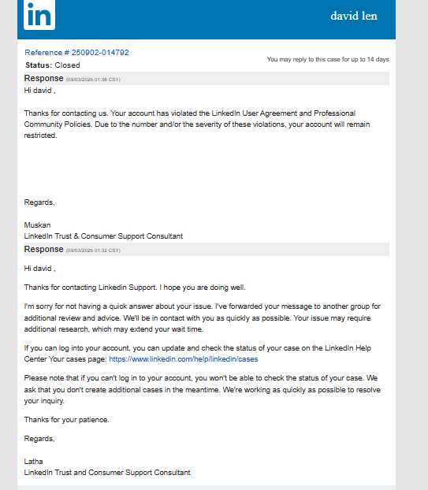
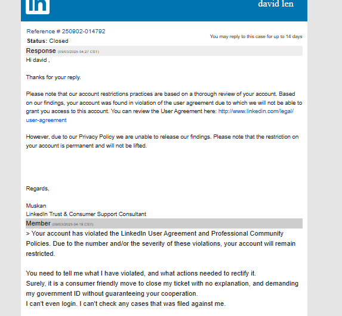

Recently, I went viral for a shitpost. 

It got more than 10x views than everything I published cumulatively. 

Some people even reposted my stuff and got greater success — it was a memetic moment.

  
Click to expand

  
  

<!--truncate-->
---
## WTF 

Unfortunately, some people just don't like other people to have fun. 

Here's proof that I got suspended from LinkedIn.

  
Click to expand

  
  
  

Honestly, I wasn't even planning to show off that I got viral. I think it's a trivial achievement. 

However, after getting deplatformed within a week, I thought I needed more insurance in the future. If not for myself, then for my audience. 

---
## Update: Permabanned

  
Permabanned

  
  

### TLDR

> you broke our rules

"Which one?"

> our rules is we cant tell you the rule

**wtf*

> btw, its permanent you not getting back your acc

**wtf^2*

Salty? Upset? You bet. 

This thing costs a decade to build, obtained a cumulative >$100K in advertising impressions and influence, encouraged >$10k of platform spending on listing, search, subscriptions, ads. 

Now? It just goes away without a trace, at their moments of notice. 

Your DMs, leads, sales, customer support pipeline you ever built goes to dumpster fire. Your investors can't find you. Your employees can't reach you. 

If this can happen to me, this will eventually happen to you. 

Anyone with capital and job-creation ability should not risk their time and money on LinkedIn knowing how my case is settled. [^1]

[You decide what's good for you](https://x.com/nelvOfficial/status/1962765559998955955).

[^1]: Maybe that's why the platform is so bad. Everyone is too worried of censorship and violation of ToS they lobotomized their content to avoid this risk. Almost no one important enough uses the platform for this exact reason. 
---
## What now?

Just bookmark my blog. Follow me on [Twitter](https://twitter.com/nelvOfficial), [Instagram](https://www.instagram.com/divadlen/), [YouTube](https://www.youtube.com/@nelvOfficial)

I'll be creating a new blog [i dont think you understand](../IDTYU) for all of my past and future shit posts. 

### What else?
I will write more about my experience lessons from this temporary virality in the future, including how I think one should go about reengineering this moment [^2]. 

[^2]: The fact that it worked for me isn't important -- it is even reposters getting better results that speaks volume about the stickiness of the format, luck of the timing, etc. 

Also, the reaction and opportunities I've been getting from the public, and how I dealt with the traffic plus negativity. 

If this wasn't done after a while, remind me by DMing me on Twitter. 

---

