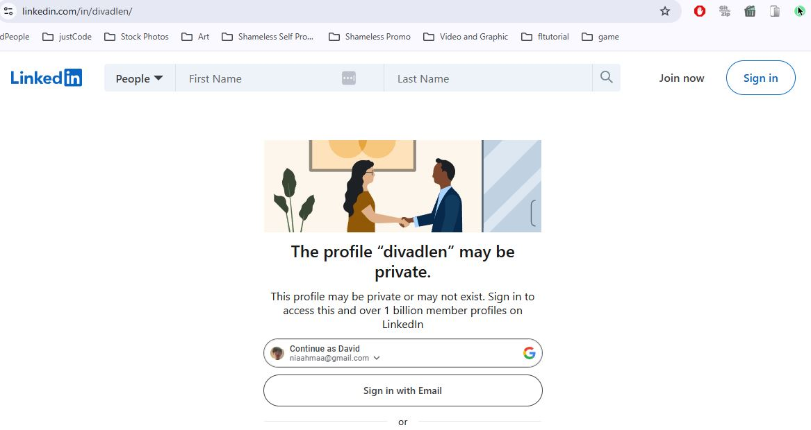
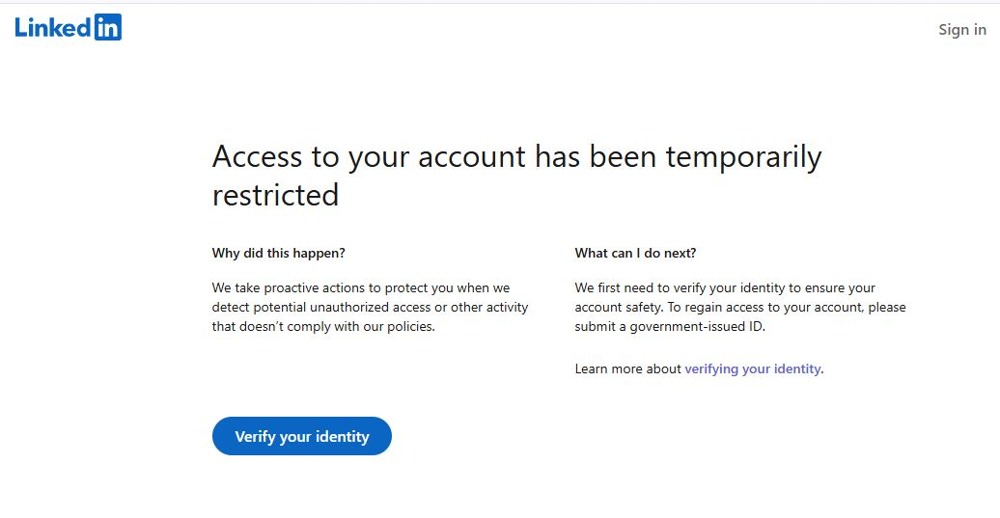

Some people just don't like other people to have fun. 

Here's proof that I got suspended from LinkedIn.

UPDATE: Permabanned. 

<!--truncate-->

  
Click to expand

  
  
  

--- 
## WTF
Honestly, I wasn't even planning to show off that I got viral. I think it's a trivial achievement. 

However, after getting deplatformed within a week, I thought I needed more insurance in the future. If not for myself, then for my audience. 

## What now?

Just bookmark my blog. Follow me on [Twitter](https://twitter.com/nelvOfficial), [Instagram](https://www.instagram.com/divadlen/), [YouTube](https://www.youtube.com/@nelvOfficial)

I'll be creating a tag [i dont think you understand](tags/i-dont-think-you-understand) for all of my past and future shit posts. 

---
## Permabanned

  
Permabanned

  
  

### TLDR

> you broke our rules

"Which one?"

> our rules is we cant tell you the rule

**wtf*

> btw, its permanent you not getting back your acc

**wtf^2*

Salty? Upset? You bet. 

This thing costs a decade to build, obtained a cumulative >$100K in advertising impressions and influence, encouraged >$10k of platform spending on listing, search, subscriptions, ads, and now it just goes away without a trace, at their moments of notice. 

You think this is going to affect me alone? Your DMs, leads, sales, customer support pipeline you ever built goes to dumpster fire. 

Your investors can't find you. Your employees can't reach you. If this can happen to me, this will eventually happen to you. 

Anyone with capital and job-creation ability should not risk their time and money on LinkedIn knowing how my case is settled. [^1]

[You decide what's good for you](https://x.com/nelvOfficial/status/1962765559998955955).

---

[^1]: Maybe that's why the platform is so bad. Everyone is too worried of censorship and violation of ToS they lobotomized their content to avoid this risk. Almost no one important enough uses the platform for this exact reason. 