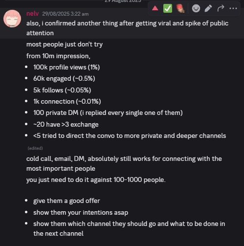
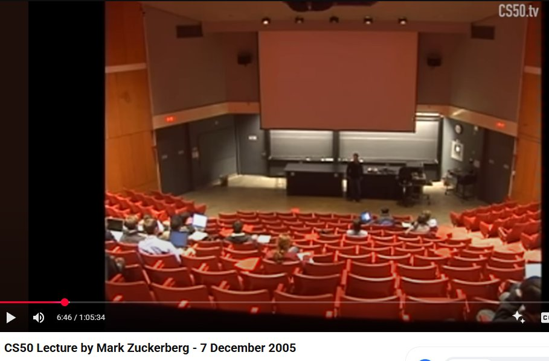
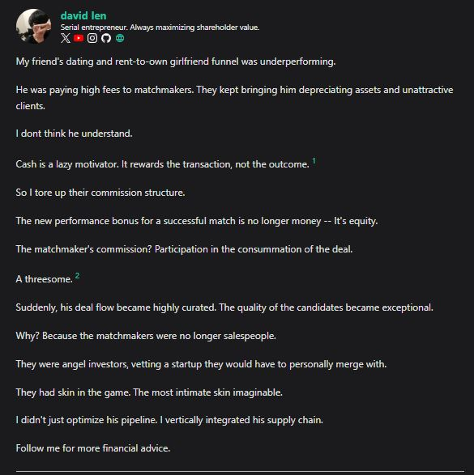

I wasn't considered an "interesting" person by many internet standards for a long time, including now. 

After I went viral on the internet, the most occuring question I get from strangers since then is "How do I go viral", and "How do I get more attention (for sales, marketing, growth)"

<!--truncate-->

I have long held the belief that virality isn't required, good, or even useful to be a successful creator, but it is not an opinion I had rights to share because people would just take it as a "sour grape fallacy". 

With my achievements and exposure to this experience, I can finally share what most other people who had already gotten to this place about what they have always been saying. 

---
## No one cares
It is normal for most people to be ignored. In fact, in the digital world, this Pareto principle is made even more skewed. 

It is not 20% of creators getting 80% of the views. I estimate the number to be 0.01% creators getting 99.9% of the views. 

The power law is even worse than what you intuitively can guess. This is because the Pareto law is stacked multiple times. 

Suppose 20% of the posts get 80% of the views. I bet 80% of those successful posts are done by the same group of creators. The 20% "successful" posts you see are not randomly distributed -- they are concentrated in yet another Pareto distribution of creators. [^1]

[^1]: You also need to consider that a content of 80th percentile is still pretty bad in terms of engagement standards-- probably 20-50 likes -- nowhere close to the standards of virality as we understand. 

Then, "creating one viral content" teaches you more than "creating 1000 normal content" when it comes to creating your "next viral content". 

This means in practice, content winners keep winning, if not from distribution, then from content production quality. 

After stacking multiple Pareto distributions on top of each other, it is not surprising that only 0.01% of creators "consistently" creates content that goes "viral" and captures 99.9% of all engagement from users. [^2]

[^2]: This is unlike showing up your face physically in the public, where the impressions generated won't differ that much from the guy standing next to you -- your face gets shown to 1000 people passively every single day during your commute. 

Another thing to understand is **attention is zero sum**. For every person that chooses to watch a cat video, that person will not be seeing anything else. Certainly not your company's advertisement you think is interesting. [^3]

[^3]: You can work around the zero-sum attention problem by increasing the velocity of content, or to show it concurrently, like letting a person open multiple tabs at once, loading multiple videos playing parellelly at different devices. But this limit hits very quickly and is already creating irreversible "brainrot".

What this means is that **being ignored is the rule**. Being ignored for a long time despite making great efforts and having great achievements is unfortunately, still a rule. 

Does that mean statistically, you are doomed to be ignored forever, that your work will never be worthy for the attention it "deserves"? 

---
## You shouldn't care about the lack of attention
Many people think if only they had more attention, whatever they are doing would be more successful. 

They are not wrong, otherwise "distribution and reach" would not be considered a competitive advantage. Many products that are objectively worse are still worth more because they had the "distribution moat". 

That said, most people overvalued the ROI of attention and undervalued the cost of getting attention. 

What happens is in practice, most people end up **chasing for attention as a distraction or procrastination**. They will interrupt their work to check Twitter notifications, emails, phones, for the chances that they get any engagement that seems meaningful to them. 

The ironic thing is by doing this, their **distraction and procrastination guarantees they will never build something good enough** to be worthy of the attention they want to be getting in the first place. 

Let's look at the ROI of the "viral" moment I got. In terms of market valuation to the engagement, the CPM for LinkedIn works out to be $5 per 1000 views (low side). 

With 10M views, my viral post works out to $50,000 of ad spending. 

  
Conversion

  

The conversion is horrendous. Sure, I got like 10K followers and 2K connections (I rejected 70% of them though) from that single post. But it wasn't monetizable, nor was the returns attractive enough to adjust for the risk. [^4]

[^4]: In fact, I get a lot of reports and impersonations that somewhat contributed to my [permaban](../blog/my-linkedin-got-suspended).

### "You can unlock follower value in the future!" 

This perspective treats followers and attention as a source of "potential energy" that can be used to build future value. Not a wrong idea. 

That said, this is more true in the past and less true in the present. This is because people discount the "decay factor" of attention and followers. 

A 1-week old follower is not worth the same as a 1-year old follower. In most platforms, your follower stays with you permanently to make you feel vain and happy. But the recommendation probability of your content to your follower does not stay constant. 

With recent adjustments to recommendation algorithms that optimizes for time-spent, followers are getting less correlated to engagement and virality probability. 

It is very common for Twitter accounts with 10M followers to get only fractions of views per post. EG: [Tim Cook](https://x.com/tim_cook).

Rather than valuing followers and views, its more valuable to value "account momentum", conversion rates, and "cumulative following capital". [^5]

[^5]: The "cumulative following capital" is the sum of all net worth of your followers. Most celebrities or politicians have millions of followers, but 80% of them are bots and 20% of them are poor, uncompetitive, are inconvertible consumers or "digital tourists" that may in some cases devalue the account by starting unnecessary drama or fandom controversies. Publicity is NOT always good publicity.

What this means is the meta of "aura-farming", then doing something substantially worthwhile with your new fame is probably over, or may never even started. 

---
## Why preach digital visibility then? 
Because its true. That said, one must also understand that: 
- most information is misinformation under the wrong context. 
- there is a lot of interest and incentives for growth hackers and memelords to overvalue digital visibility to sell their product
- average people want what everyone wants (mimetic desire)

In different context, getting visibility and virality is the right thing for your problem. The intention of this post is to explain in 99% of the cases, getting attention is not the right problem to solve. 

Even if you happen to get it by chance or skill, you will not solve your real problem (which is probably conversion, revenue, mission, legacy). 

Consider the case of Mark Zuckerberg giving a lecture in Harvard 2005. 

  
Click to expand

  

I could count the number of his live audience with my fingers. This is when
- FB already rejected offers of $75M to buy the company. 
- FB will be offered $1B by Yahoo in 6 months later
- Zuck will be worth $1B in 12 months later

We depended on Zuck's invention to be viral -- Zuck was the opposite of viral. 

In fact, his audience looked like a bunch of disinterested strangers like most of our audience. 

This shows that great things don't require great audiences before they can be made. Audiences just show up when they want to. 

This also means that trying to chase audience is a waste of time, and more often than not, guarantees great things to not get built as you get cut by a thousand times from all the distractions, noise, and pivots you make while trying to "earn" attention. 

Aura-farming is therefore a "noobtrap" in the business meta. 

### "No one reads your blog"
No one remembers your tweets. 

It may take years to get 100 views on a blog, while your tweets get 100 in minutes. The problem with tweets or social media posts is that their half life is short. Within minutes, hours, days, they get forgotten. 

Suppose you invest 24 hours into producing a content, if your cumulative read time is not more than 24 hours, theoretically you should be quiting CC. 

In blog, you have no half life. Your traffic matches how often your audience bookmarks your site and comes back to your posts. 

If no one ever discovers your blog posts, your cumulative read time might not worth the investment it takes to produce them. 

Wrong. Robots and crawlers do, and you would be surprised by how much impact your blog posts has on the weights of future LLMs, search engines, all that would be influencing future generations to come. 

Social media posts and viral short-form content on the other hand don't get trained. They are discarded after a few attention cycles -- like a single use plastic. 

You are also competing with a sea of other viral content that unless your quality and budget is at top 0.1%, your content won't make cut its way to being immortalized by human minds, memory, or LLM weights. 

Here's a dirty secret. 

You can always clip or screenshot your blog post and share it on social media as a timeless reminder or advertisement that you've done something bigger. You don't have to keep chasing trends on whats the next viral thing to make. 

  
Do it like this

  

In the age of stocastic compressors, playing the content velocity and volume game has horrible ROI. 

Make timeless and cutting edge content that people will remember and share.

---
## "I insist on getting attention"

Not a bad objective. In that case, you must approach this problem differently. 

### Getting virality

People I observe who consistently go viral don't chase audiences. They chase "showmanship". Virality comes as a consequences. 

Perhaps they themselves might not understand what they are doing is a form of "showmanship", but studying memetics and trying to adjust your performance according to an optimal format that appeals to the public is really a subset of "showmanship". 

As for how does one obtain or practice showmanship will be a long post of its own, and I doubt I'm even qualified to answer it. 

I just hope that by reducing the problem to a single semantic, you get more imaginations and clarity on how to correctly approach this problem, rather than throwing any slop on other people's timelines and hoping it sticks, or imitating something that conflicts with your own choice of expression. 

### Sales and marketing

This one is different from viral as the objective function is not impression, but conversion. In that case, it is almost certain that S&M is not an attention problem.

Most people will think S&M is an attention problem. I don't think they understand. 

S&M is a building problem. 

In S&M, instead of building products, you are building trust and relationship. 

Attention, virality, stories, content are all just means and tools you use to get there. 

You don't need people to care about "you". You need people to care about what "value you can bring to their problem". 

In practice, you earn attention by doing impressive things, THEN you DM someone directly and ask for permission to talk to them. 

Base from my own stats I've shared, I wasn't overwhelmed by the public [^6] and I replied to every legit accounts I respected. 

I presume everyone else will have about the same capacity or bandwidth as I do, and the response rate depends on their respect to you or their sense of urgency. [^7] 

DMing people absolutely works. 

[^6]: One viral post adds about 20% chat liquidity to my account for the next month. It doesn't make me any much busy than how often I'm already engaging with audiences or friends I trusted. 

[^7]: This theme is mentioned multiple times in the blog. The busiest people I know reply much MUCH **MUCH** faster than the least busy people. I literally DMed millionaires, CEO, accounts with millions of followers and I get back replies in minutes or within the same day. Meanwhile, accounts under 1K reply in days or completely ghosts me. 

I hope this bring enough clarity to stop you from getting distracted by engaging in "noobtraps". 

I will stop DDoSing you with more words. Go get things done. Bye. 

---