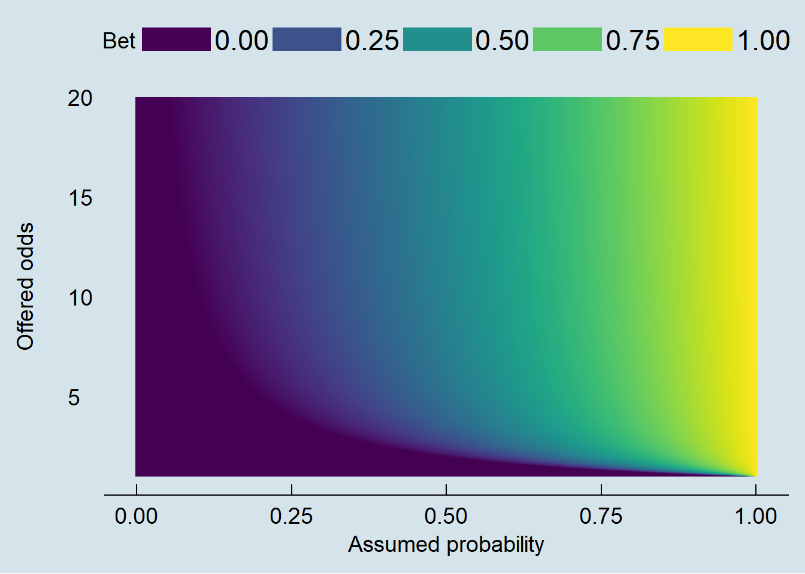
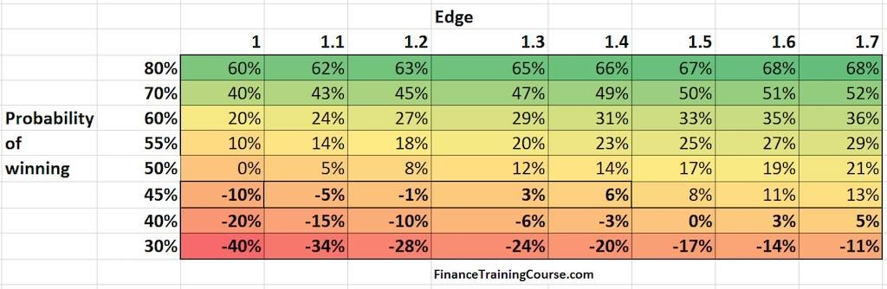
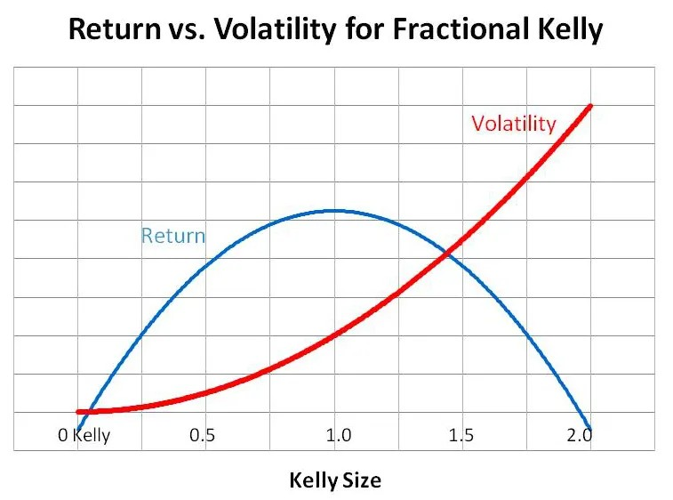

Rituals, often perceived as irrational or wasteful, consume a significant portion (30-40%) of our resources, from personal finances to corporate budgets and national GDP. 

Here, I try to explain why rituals seem inescapable, arguing that they function as a "belief tax," fostering trust, facilitating leveraged action, and acting as a costly signal to ensure loyalty and eliminate uncompetitive ideas.

It's the equivalent of setting a Typescript schema or interface that intentionally slows down your development, but guards against production bugs and sets the standard for the evolution of the future codebase. 

The long way is the shortcut. The shortcut is the long way. 

<!--truncate-->

## Understanding rituals

Think about it: a hefty chunk of every paycheck, every company budget, and even national GDP is dedicated to things that, on the surface, seem…well, a bit pointless. 

We're not talking about essential expenses like food or shelter, but rather the unspoken rules, the routines we follow without question. 

A ritual is not just religious practices or spooky voodoo. It is any set of actions performed without question. 

It's the morning coffee ritual, the elaborate handshake among friends, the annual company retreat. It's about the behaviors, not necessarily overt spiritual beliefs.

### Business
Business in particular is a great place to observe modern rituals. The pursuit of efficiency and profit makes irrational practices stick out, making the "belief tax" especially obvious.

According to SHRM, companies spend, on average, $4,129 USD to hire a new employee, and the process taking about 44 days. This works out to be 15-30% of national minimum wage. 

In practice and in my experience, hiring and admin process to get someone through the door works out to be about 30-40% of payroll budget. As an employer, you also have to count the payroll taxes and social security contributions. It is not uncommon the real cost of labor is 40-50% more than what your employees cumulatively get paid. 

Agile, Six Sigma Kaizen methodologies [^1], which dominate software development are rife with rituals. Sprint planning, daily standups, sprint reviews, and retrospectives are all designed to align the team around a common goal and promote CI/CD. 

[^1]: I've memed this methodology too much that it looks unserious to anyone who had followed me long enough. I assure you this really exists in corporates. 

Most engineers would describe these ceremonies as rigid, time-consuming, potentially hindering productivity if not managed effectively. A 15-minute standup that stretches to an hour, filled with bike-shed discussions and unnecessary updates, is a classic example. 

The worse part is the PM and consultant who came up with these rituals get paid as much if not more than those who are doing the work and are exposed to the risks of practicing the ritual. It's not wrong for the engineer to feel like he's the one getting sacrificed for the ritual.

<!-- So, why do we do it? Why do we persist in these seemingly inefficient and wasteful practices? 

The answer, in part, is trust. These rituals, however inefficient, create a shared experience, signaling commitment among employees and employers. 

The rigorous hiring process assures the new hire of the quality of the company they are joining, while it also guarantees the incumbent workers that the candidate is vetted to be as competent as them. 

Agile ceremonies, when done right, foster a sense of shared ownership and responsibility, building trust among team members and encouraging them to work towards a common goal. 

However, trust is an emergent property. You can not simply make people trust each other without sufficient "skin in the game". Agile methodology is a belief system that requires one to make many sacrifices to earn trust. 

One may argue that the costs of rituals is what you pay because "you don't trust" your followers. This is not wrong. But its important to understand that rituals can simultaneously be the consequence and causality of trust. -->

### Religion

Religions often demand a significant time commitment from their followers. Attending services, participating in community events, engaging in personal prayer or meditation, and studying religious texts can take up a considerable portion of one's week. 

In many faiths, adhering to specific dietary restrictions or observing religious holidays further adds to the time investment. Cumulatively, this works out to be about 3 out of 7 days of our time per week spend on religious rituals.

Money-wise, followers are often asked for donations, tithes, upkeep of religious buildings, support for religious organizations. 

After accounting for time, financial donations, labor, mental real estate, the number works out to be about 30-40% of our lives. 

### Political & economic systems
Imagine, we could have got back 40% of our money, time, energy, and mental bandwidth for not being religious. Many people would have been happy to do so. 

Indeed, many people would have been happy to do so. But they would replace them with new ideologies. 

If its democracy, we would need to raise money for elections that happen once every 4 years. It would be paid for using follower donations, public lendings, or the classic money printing trick that hides the costs of election within inflation.

If it's capitalism, then they would spend 40% of their economic output on taxes, legal fees, other bureaucracy that defends the capitalist system they live with. 

Suppose they are unemployed. They will still use money. Money itself is a belief system that demands rituals to be legitimized. One of the rituals required to defend the belief system of money is that the issuing country of the reserve currency must have the most powerful military. That works out to be 2%-10% GDP, that can go up to 20% GDP during war time. 

### Personal relationships
Elaborate wedding ceremonies, anniversaries, Valentine's Day, birthday celebrations -- these are all rituals reinforcing the commitment and shared belief in the relationship. 

The expense and effort involved in planning a wedding signal a serious commitment. It is not uncommon for a wedding to cost up to 3 to 10 years of a middle-class man's retained earnings. 

Meanwhile, anniversaries and other milestones provide opportunities to reaffirm that commitment.

For the casuals, we still pay to play the dating "Game". The rituals of courtship, signaling interest and commitment, are deeply ingrained in our social fabric. From buying flowers to planning elaborate dates, working out and making up to maintain appearances. 

An average man would be shocked to learn how much time and money a woman budgets for just keeping up appearances. 

Discounting diet and nutrition, my estimation works out to be about 40% of a woman's earnings/allowances is spent on make up, cosmetics, clothing, hair, body. 

Time-wise, 40% of a woman's "non-working" time spent on engaging those activities. [^2]

[^2]: One may argue that it is in the woman's interest to be doing those activities. For them, keeping appearances is a "fun" ritual. In that case, it won't be surprising to see the commitment to consume 60-80% of their excess finance or time budget. The 40% estimation is based on the assumption that the activities are simply just done regardless of it being voluntary or not. 

These are stuff people do before we even get to the real purpose of all of these commitments, that is---

### Sex and reproduction
We want to fuck. 

Sex are also rituals organism engages in with its end objective to distribute or replicate genes. 

Biology could have turned all of us asexual, but it didn't. Most complex organism gradually evolves to only get reproduced sexually. 

The result is many complex organisms like animals and humans evolved many counterproductive, physical handicaps, or social handicaps, that lets us engage in rituals that wins them the fight or right to reproduce.

Antlers on deer, peacock feathers, and other extravagant displays may seem counterproductive from a survival standpoint, as they can hinder movement and make the animal more vulnerable to predators. 

However, they serve as signals of genetic fitness to potential mates. The larger and more elaborate the display, the more attractive the animal is likely to be.

Elaborate mating dances, territorial displays, physical aggression are common rituals in the animal kingdom. These behaviors can be risky and time-consuming, but they are essential for attracting mates and establishing dominance. 

---
## The "Belief Tax" 

It seems like everywhere we go, we keep noticing "deadweight" spending on rituals for belief systems that may or may not be rational. 

Why do we put up with all this apparent waste? Why do we dedicate such a significant portion of our resources -- that 30-40% we talked about -- to rituals that seem, on the surface, inefficient or even pointless? 

The answer, fundamentally, is that it's an investment in something much more valuable: trust. 

Trust is the social lubricant that allows complex systems to make transactions and cooperate with each other, and rituals are the price we pay to generate and maintain that trust. 

In chemistry terms, rituals is like the "catalyst" used to speed up a reaction. 

In crypto terms, rituals is the "proof-of-work" we do to allow the transaction to be added to the blockchain ledger. 

This "Belief Tax," as we're calling it, is not just about avoiding direct harm, but also about maximizing potential upside through leveraged action and shared understanding.

### Paying the "belief tax" is cheaper than the cost of doubt
When people dont trust the process, they come up with a lot of new analysis that are more expensive cumulatively than investing in a ritual over the long run. 

Think of a manager who delays a crucial decision for weeks, gathering more and more data, until the opportunity has passed. 

Or a software development team that endlessly debates the merits of different technologies, never actually building anything. 

The time, energy, and resources spent on this excessive analysis could have been used more productively on actually just *doing* the work.

### You pay the tax with suboptimal Kelly

People who doubt the process are also less leveraged in their actions. When individuals or organizations lack trust in a process or a system, they tend to hedge their bets, to take smaller, more conservative risks. This leads to slower growth and missed opportunities.

If you are into gambling, trading, or investing, perhaps you might have came across a mathematical concept known as **Kelly criterion**.

The Kelly Criterion, a mathematical formula for determining the optimal size of a bet, illustrates this point perfectly. It states that the optimal fraction of capital to bet is the edge (the expected return on investment) divided by the odds. People size their bets based on win probability and expected return on investment. 

  
Kelly Bet size

  
  

Basically, the Kelly table or heatmap shows how much percent of your holdings you should bet on a bet with a certain probability of winning. 

:::success Example
For example, if you have 60% win rate and you win $1 dollar for every $1 dollar you bet, then your kelly optimal bet size (abbreviated as K) is 20% of total portfolio. 

At 80% win rate and 1.7 ROI, you bet 68% of your portfolio.
:::

However, the thing most people don't understand is "Kelly Optimal" is only optimal in long-term capital generation, but not in volatility. 

From chart below, volatility grows exponentially with kelly bet sizing. 

  
Volatility

  
  

This means in practice, Kelly optimal bet **is actually a bad bet** and seldom done in real life [^3] because of how often it leads to bankruptcy, financial ruin, or irrecoverable drawdowns.

[^3]: Sorry poker players. You think you are smart when you learned Kelly optimal. It's actually a bad play that cause you to go bankrupt quite often. 

After controlling for volatility, the risk-adjusted kelly optimal is around 0.5K. The growth rate of capital is cut to half, at the benefit of reducing volatility by over 80%.

Quantitatively, this is what I meant by doubting the process. 

Because one doubts processes, they will implement rational devices, guards, systems to avoid overbetting, leading to unlevered capital growth. 

When one "trusts the process", they will go full Kelly in every thing they do. This often works out well in the short term, and if the decision or judgment happens to be right. 

The "cost of doubt" that was paid may not necessarily be limited to computation cost, but also includes "uncaptured opportunities". 

A belief system that trusts the process grows faster than a belief system that is more rational and rightfully conservative during boom times. 

Of course, the risk of being levered on the wrong decision is high, even catastrophic. 

Betting the farm on a flawed idea, blindly following a charismatic leader, or investing heavily in a failing venture can lead to ruin. 

We see dogmatic religions or belief systems that demand absolute obedience in the process to fall apart or get wiped out in history very often. 

This is why a healthy dose of skepticism and critical thinking is always essential. The key, however, is to find the right balance between trust and doubt. [^4] [^5]

[^4]: You would expect in the long run, only the risk-adjusted return belief system would survive. However, one must understand the sheer amount of different belief system that can exist simultaneously in the same time. 

[^5]: An "irrational" belief system that encourages obedience and rituals can be leveraged on the lucky, right thing to work on -- that it grow so much to take over other belief systems. Therefore, my position is that at any given point of time, the most dominant belief system must necessarily not be risk-adjusted kelly optimal. Which is another way of saying it will involve in wasteful investments in rituals that encourage obedience. 

In other words, the trust multiplier in most cases is too good to not pay with rituals. 

---

## Rituals as a "cost of entry" 

Previously, we discussed rituals as a redundant system we set up to enable leveraged bets later for stronger economic growth. This is only one perspective. 

It is also possible its an economically destrictive practice that was still done regardless. The alternative explanation is they act as a "cost of admission" to a particular belief system, ensuring that only those truly committed are willing to participate. 

The expense of rituals acts as a powerful commitment device. By investing significant time, money, effort -- sunk costs are intentionally driven within individuals and demands increased dedication and stakes in its success. 

Think about joining a gym and paying for a year-long membership. The upfront cost makes you more likely to actually go to the gym, justifying the initial investment and reinforcing your commitment to fitness. 

Similarly, the investment in a wedding ceremony, a down payment on a house, or years of dedicated study for a profession all serve as commitment devices, solidifying one's investment in the associated belief systems (marriage, property ownership, career).

The sunk costs create a powerful disincentive to abandon the existing commitment. It's like being locked into a long-term contract -- even if a better offer comes along, the penalty for breaking the contract might be too high. 

In religion, this can manifest as the fear of divine retribution or social ostracism. In business, it could be the loss of equity, the tarnishing of one's reputation, or the forfeiture of a hard-earned promotion.

In this perspective, this practice is irrational for everyone but for a ruler. As a ruler, rituals is what you need to legitimize your rule. 

---

## Rituals as filtering mechanism
Rituals can be seen as a powerful filtering mechanism in the spread of memes (ideas). 

A meme is a unit of cultural information transmitted from one individual to another. Rituals can act as gatekeepers, allowing only "fit" memes to propagate. Those memes that can withstand the "cost of entry", IE: the requirements of participation in the ritual -- are more likely to survive and spread. 

For instance, a scientific theory that requires years of study and rigorous experimentation to understand is less likely to gain widespread acceptance than a simple, easily digestible conspiracy theory. However, the scientific theory, because of its high cost of entry, is likely to be more robust and reliable. [^6]

[^6]: This is a heuristic that easily falls to appeal to authority fallacy. 

### Filtering in software
In software development, the adoption of TypeScript illustrates this filtering mechanism. 

TypeScript introduces a layer of complexity -- the need to define types and interfaces -- that can be annoying during development. 

Many beginner developers or vibe coders like resisting this complexity, preferring the more "free-wheeling" nature of JavaScript. 

However, TypeScript's stricter type system guards against production bugs, improves code maintainability, and sets a higher standard for the evolution of the codebase. 

The "cost of entry" -- the extra effort required to learn and use TypeScript -- filters out developers and projects that are unwilling to invest in long-term quality and stability. Only those committed to producing robust and maintainable code are likely to embrace TypeScript.

### Filtering in group identity
The higher the "cost of entry", the greater the guarantee of loyalty to a belief system and foster a strong sense of group identity. 

Sharing common rituals creates a sense of belonging, strengthens social bonds, and distinguishes the group from outsiders. From wearing specific clothing to participating in shared ceremonies, rituals reinforce the boundaries of the group and promote cohesion. 

In practical cases with a cynical perspective, we have a 4-year college indoctrination as a proof of loyalty you belong to a caste of elites. We have LinkedIn profiles and cringe posts as daily rituals we do to stay relevant in the employment industry. 

In more extreme cases, we have high barriers to entry to dangerous organizations like Yakuza or Mafia, which traditionally requires a member to form a "blood pact" [^7] with the godfather before they can be accepted.

I speculate the Epstein Island and the "indulgence of minors" are modern blood oaths taken by today's wealthy and powerful to get into the secret cabal for whatever reason. [^8]

[^7]: Which is another way of saying they must kill and get away with murder.

[^8]: Otherwise its hard to explain why is it that the Epstein list never gets revealed to the public, and every politician from either side of the spectrum are fighting so hard to keep it secret. The whole behavior smells like a political cartel against the common people. 

---
## Be conscious of rituals

While rituals can be beneficial, we also see examples when they can be excessive, counterproductive, and even dangerous. 

Rituals can easily devolve into bureaucracy, dogma, and blind obedience. 

When rituals become ends in themselves, rather than means to an end, they can stifle creativity, discourage critical thinking, create unnecessary barriers to progress, and leading to intolerance and persecution. 

Think of a company where meetings are held solely for the sake of holding meetings, with no clear purpose or outcome. Or a religious institution that prioritizes adherence to outdated traditions over compassion and social justice.

History is filled with examples of the dangers of dogmatic belief systems that demand absolute obedience. 

From the Spanish Inquisition to the Cultural Revolution in China, the unquestioning acceptance of authority and the suppression of dissenting voices have led to horrific consequences. 

Innovation often requires challenging existing rituals and breaking free from established patterns of thought. Progress is driven by those who dare to question the status quo, to experiment with new approaches, and to challenge conventional wisdom. 

Designing a good ritual is an act of innovation. Why stop there, when we can go one meta above to the "maintenance" of rituals?

---