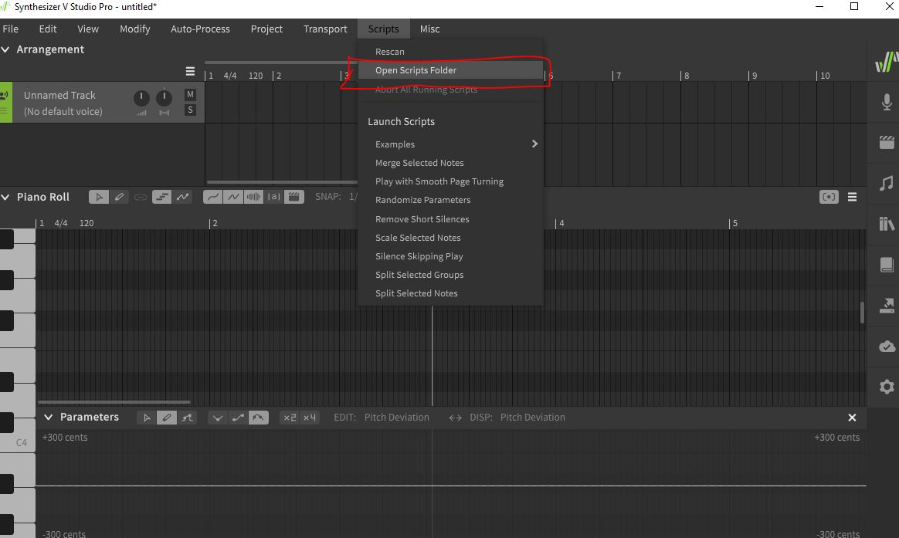
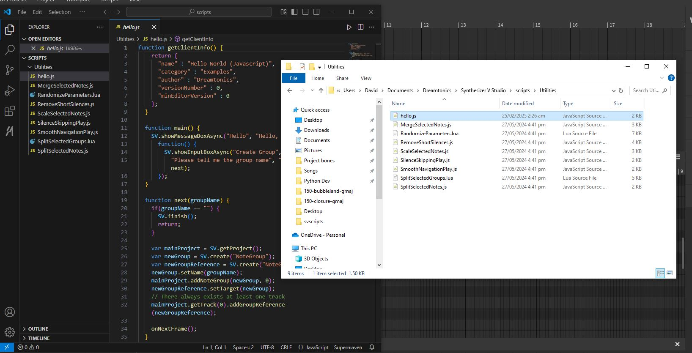

Synth V supports developers to [build their custom scripts](https://svdocs.dreamtonics.com/en/synthv/advanced-usage/scripts). This section covers the basics of creating and using scripts.

I would spare you the details on how the scripting works. Its all in the [official docs](https://resource.dreamtonics.com/scripting/index.html). 

The aim of this documentation is to show how one can quickly get started in building a script. 

<!--truncate-->

---

## Finding your script files 


### Check out the script dir
In script directory, create a `.js` or `.lua` file containing the script logic.

Dreamtonics team has shared a pretty good [example to start](https://github.com/Dreamtonics/svstudio-scripts/blob/master/HelloWorld/Hello.js), so just copy the file or paste the code in a `.js` file, then save it in the directory referenced by Synth V.



From `Scripts` >> `Examples` >> `custom file`, you will launch the script and modify the project. If you can't find the file, use the `Rescan` button to refresh the directory.


---

## More custom scripts
Example [lua script](https://github.com/ftsf/synthv-impkit/blob/main/backspacenote.lua). 
<details>
<summary>Show `backspace.lua`</summary>

```lua
function getClientInfo()
    return {
        name = "Backspace Note",
        author = "impbox",
        versionNumber = 1,
        minEditorVersion = 0
    }
end

function getTranslations(langCode)
    -- please help add translations <3
    return {}
end

function main()
    local sel = SV:getMainEditor():getSelection()
    if sel ~= nil then
        local notes = sel:getSelectedNotes()
        if #notes > 0 then
            local lastSelectedNote = notes[#notes]
            local group = lastSelectedNote:getParent()
            local i = lastSelectedNote:getIndexInParent()
            if i > 1 then
                local newNote = group:getNote(i - 1)
                group:removeNote(i)
                sel:clearAll()
                sel:selectNote(newNote)
            end
        end
    end
    SV:finish()
end
```
</details>

---

## Community scripts
Why build one when someone probably already has some of the the scripts you are looking for? 

This is the [best resource I found so far](https://synthv.neocities.org/resource-scripts). Not going to reinvent the wheel. 