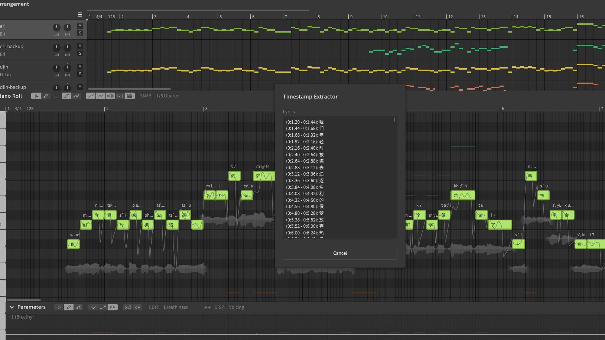

Had an annoying problem, which is to approximate the timestamp of the lyrics when I want to insert lyrics into my videos. 

Traditional method is to literally play the song live while editing the words and timing one by one. 

If you had already written your lyrics in Synthesizer V, using the script below will return you the timestamp for each lyric. 

- Timestamp automatically adjusts based on the BPM of the project. 
- Timestamp returns for each syllable. (No clustered sentences like a transcript. I don't want to over engineer it)
- Offset parameter if your video/music is not in sync with the score.

<details>
<summary>Show preview</summary>


</details>

<details>
<summary>Show `TimestampLyrics.js`</summary>

```js
const SCRIPT_TITLE = "Timestamp Extractor";
var message = "Retrieves the timestamp for each lyric.\n" +
"\n" +
"Use offset if your video/music is not in sync with the score.\n" +
"\n" +
"Timestamp automatically adjusts based on the BPM of the project.\n" +
"\n" +
"Script has not tested with tempo automation. Use at your own risk.";


function getClientInfo() {
    return {
        name: SV.T(SCRIPT_TITLE),
        category: "Lyrics Processing",
        author: "NEL-V",
        versionNumber: 1,
        minEditorVersion: 65536
    };
}

function secondsToMinutes(seconds) {
  return (Math.floor(seconds / 60) || 0) + ':' + ((seconds % 60).toFixed(2));
}

function main() {
  // Get the project's BPM
  var project = SV.getProject();
  var timeAxis;
  if (project) {
      timeAxis = project.getTimeAxis();
  }
  
  // Input form with a text field for the offset
  var inputForm = {
    "title": SV.T(SCRIPT_TITLE),
    "message": message,
    "buttons" : "OkCancel",
    "widgets": [
      {
        "name": "offset",
        "type": "TextBox",
        "label": SV.T("Offset (seconds)"),
        "default": "0",
      }
    ]
  };

  // form submission
  var result = SV.showCustomDialog(inputForm);
  if (result.status == "Cancel") {
    SV.finish();
    return;
  }
  if (result.status == "Ok") {
    var offsetSeconds = result.answers.offset;
  }

  // form validation
  var offsetSeconds = parseFloat(result.answers.offset);
  if (isNaN(offsetSeconds)) {
      SV.showMessageBox(SV.T(SCRIPT_TITLE), SV.T("Please enter a valid numeric value for the offset."));
      SV.finish();
      return;
  }

  // Get the current selection
  var selection = SV.getMainEditor().getSelection();
  var selectedNotes = selection.getSelectedNotes();
  
  // No notes selected.
  if (selectedNotes.length === 0) {
      SV.showMessageBox(SV.T(SCRIPT_TITLE), SV.T("No lyrics found in the track."));
      SV.finish();
      return;
  }
  var lyricsMerged = "";

  // Iterate through selected notes and merge lyrics
  for (var i = 0; i < selectedNotes.length; i++) {
      var note = selectedNotes[i];
      var currOnset = note.getOnset();
      var currLyrics = note.getLyrics() || "";

      // Convert to seconds using TimeAxis and offset
      var noteStart = currOnset;
      var noteEnd = note.getEnd();
      var noteStartSeconds = timeAxis.getSecondsFromBlick(noteStart) + offsetSeconds;
      var noteEndSeconds = timeAxis.getSecondsFromBlick(noteEnd) + offsetSeconds;

      if (currLyrics.length > 0) {
        // Handle special cases.
        if (currLyrics[0] === ".") {
            // Phonetic input.
            lyricsMerged += " (" + noteStartSeconds.toFixed(2) + ", " + noteEndSeconds.toFixed(2) + "): " + currLyrics.substring(1) + "\n";
        } else if (currLyrics === "-") {
            // Legato - do nothing
        } else if (currLyrics === "+") {
            // Syllable break - do nothing
        } else {
            lyricsMerged += " (" + secondsToMinutes(noteStartSeconds) + " - " + secondsToMinutes(noteEndSeconds) + "): " + currLyrics + "\n";
        }
      }
    lastEnd = note.getEnd();
  }

  // Create the custom dialog form
  var outputForm = {
    "title": SV.T(SCRIPT_TITLE),
    "buttons": "Ok",
    "widgets": [
        {
            "name": "lyrics",
            "type": "TextArea",
            "label": SV.T("Lyrics"),
            "width": 400,
            "height": 300,
            "multiline": true,
            "readonly": true,
            "default": lyricsMerged || SV.T("No lyrics found in the track.")
        }
    ]
  };

  // Show the custom dialog
  SV.showCustomDialog(outputForm);
  SV.finish();
}

```
</details>