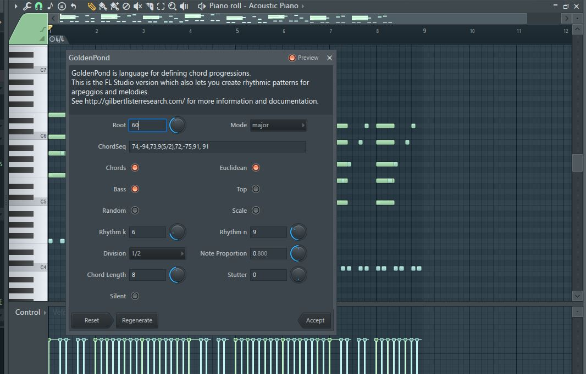
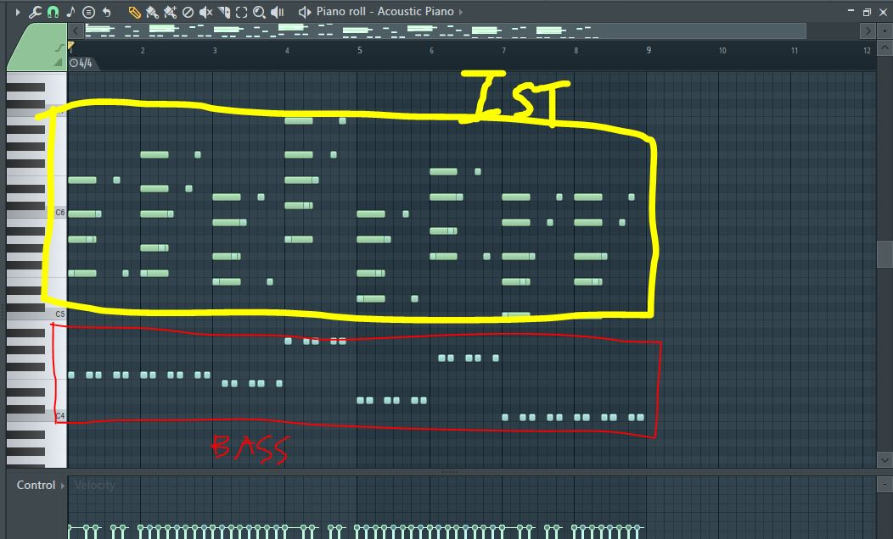

Welcome to the music production basics guide! 

## Getting Started

Before diving into specific elements, make sure you have:

- A Digital Audio Workstation (DAW) installed (e.g., FL Studio, Ableton, Logic Pro).
- Basic knowledge of your DAW's interface.
- Basic understanding of music theory (circle of fifths, key signature, time signature, BPM)

## Production Elements
Typically, any music will contain 4 elements by order of priority: drum, bass, instruments, vocals. 

Automation is another rabbit hole to get down to. But every composer at the very least needs to make 3 layers to finish the music. 

## Minimal Example
Go to [GoldenPond](https://gilbertlisterresearch.com/GoldenPond.html) and download the piano roll script file. 

If you don't know how to use piano roll scripts, check out the [piano roll scripting guide](../2-advanced/fl-pyscripts/fl-pyscripts.mdx). Alternatively, you can just look at the generated output and get an idea on what you need to have. 

From the script dialog, enter the following:
`74,-94,73,9(5/2),72,-75,91, 91`

The minimal version is actually `4,4,3,5,2,5,1,1`, which corresponds to the following: 
- 4th chord > 4th chord > 3rd chord > 5th chord > 2nd chord > 5th chord > 1st chord > 1st chord

Show GoldenPond script dialog

Show generated output

### Interpreting the output
- Bass is boxed in red 
- Instruments (chords and arpeggios in this case) is boxed in yellow. 
- The bass notes corresponds to the "root of the chords" generated by GoldenPond. 

### "I'm lost with what you doing" 
I take for granted with your ability to understand music theory and chord progressions. I will not go through what is C5, Bb5, and how chords are built.

GoldenPond basically attempts to generate a sequence of progression by the "chord number" of a scale. (I-IV-V-I >> 1451 in GoldenPond). 

The tutorial is to get a minimal example of how to create a convincing sounding song at the minimal input (code generated most intuitive) to raise your confidence. 

## What's next?
1. Producing a good chord progression for instrumentals
2. Producing a good bassline 
3. Producing a drum pattern 
4. Producing a vocal pattern
5. Stitching each part into a coherent song
6. Mixing
7. Mastering
---

