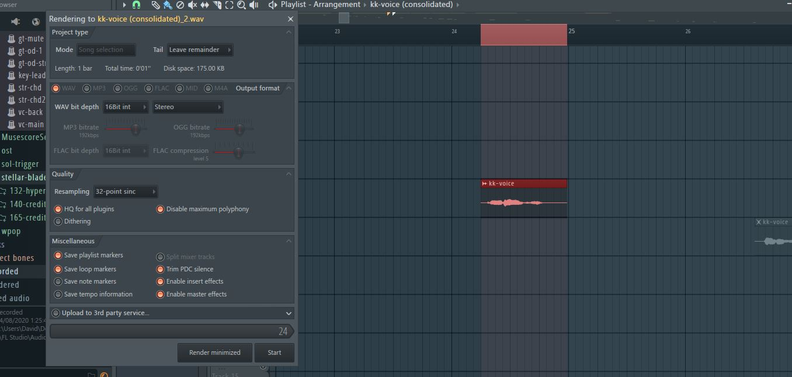
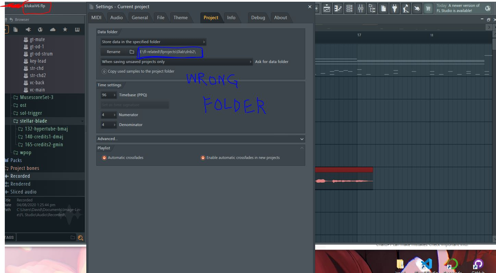

## Use hotkey CTRL + ALT + C
Select the audio you want to export, then press the hotkey. 

Selected audio + hotkey popup

### !IMPORTANT! 
FL does not let you choose the directory to export to and will default to your project's root folder. 

**You will save to the wrong folder if your FLP is copied from an older project!**

 To fix this, you must set the root in your project settings. 

Changing the root folder of project

