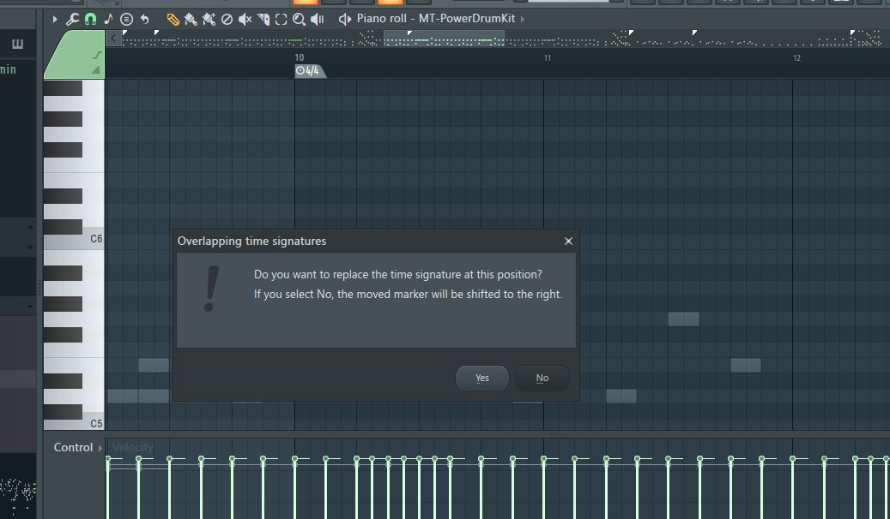
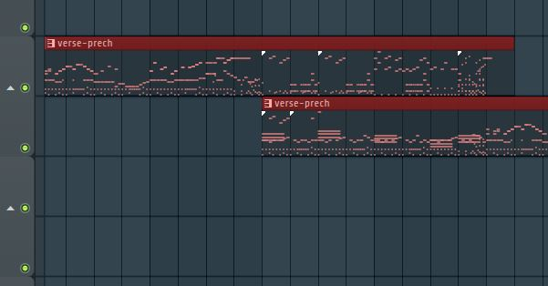
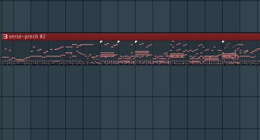
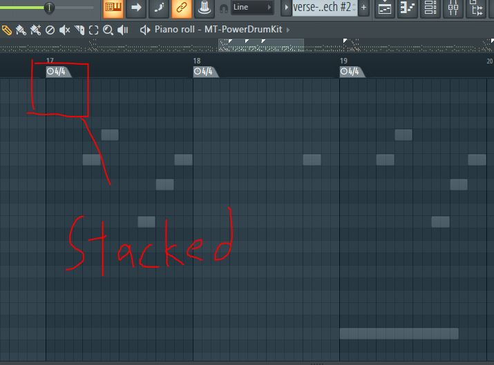
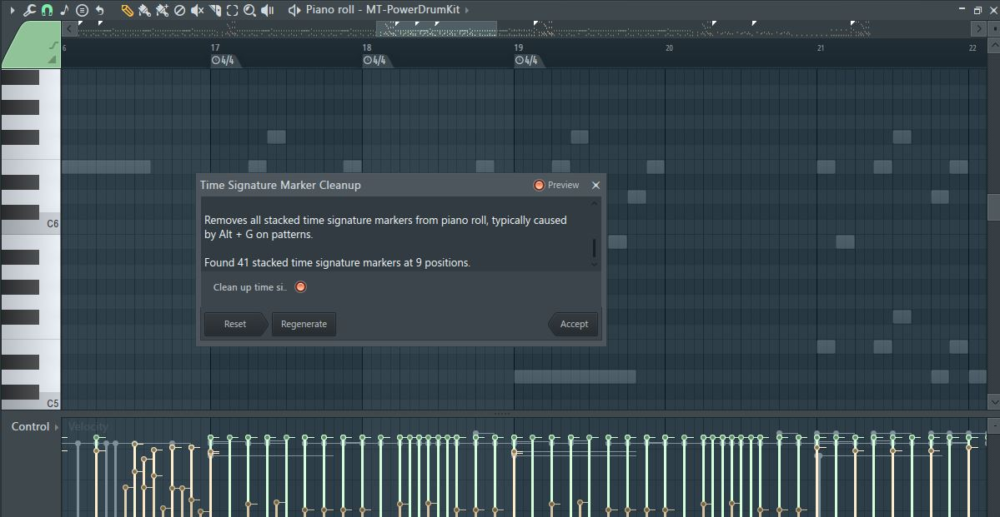

## Problem
I have an annoying problem with FL studio when trying to do arrangement with my method. 

In FL Studio, the piano roll typically guards against stacked time markers. 

<details>
<summary>Autoguard from stacked markers</summary>

</details>

However, if you use the `CTRL + G` method to merge patterns from the playlist window, the piano roll will not guard against stacked markers. 

<details>
<summary>Example merge</summary>
Pre-merge



Post merge



</details>

## Pyscript solution
The following script will remove all stacked markers. Importantly, it will preserve the time signature markers! 

<details>
<summary>Cleanup stacked markers</summary>

```python

import flpianoroll as flp

dialog = """
by NEL-V
version: 0.1

Removes all stacked time signature markers from piano roll, typically caused by Alt + G on patterns. 
"""

def createDialog():
    # Find stacked time signature markers (markers at the same time position)
    time_sig_markers_by_time = {}
    
    for m in range(flp.score.markerCount):
        marker = flp.score.getMarker(m)
        
        # Check if this is a time signature marker (has tsnum and tsden properties)
        if hasattr(marker, 'tsnum') and hasattr(marker, 'tsden'):
            time = marker.time
            
            if time not in time_sig_markers_by_time:
                time_sig_markers_by_time[time] = []
            
            time_sig_markers_by_time[time].append({
                'index': m,
                'tsnum': marker.tsnum,
                'tsden': marker.tsden,
                'time': marker.time,
                'name': marker.name if hasattr(marker, 'name') else ""
            })
    
    # Count markers to be removed
    stacked_count = 0
    positions_with_stacks = 0
    
    for time, markers in time_sig_markers_by_time.items():
        if len(markers) > 1:
            stacked_count += len(markers) - 1
            positions_with_stacks += 1
    
    # Create the dialog
    title = "Time Signature Marker Cleanup"
    
    if stacked_count == 0:
        description = "No stacked time signature markers found."
    else:
        description = f"Found {stacked_count} stacked time signature markers at {positions_with_stacks} positions."
    
    form = flp.ScriptDialog(title, dialog + "\n" + description)
    
    if stacked_count > 0:
        form.AddInputCheckbox("Clean up time signature markers", False)
    
    # Store data for use in apply
    global time_sig_data
    time_sig_data = {
        'stacked_count': stacked_count,
        'markers_by_time': time_sig_markers_by_time
    }
    
    return form

def apply(form):
    global time_sig_data
    
    # Exit if "Close" was pressed or there are no stacked markers
    if time_sig_data['stacked_count'] == 0:
        return
    
    markers_by_time = time_sig_data['markers_by_time']
    
    # Create a list of indices to delete (in reverse order to avoid shifting issues)
    indices_to_delete = []
    
    for time, markers in markers_by_time.items():
        if len(markers) > 1:
            # Keep the first one, mark the rest for deletion
            for i in range(1, len(markers)):
                indices_to_delete.append(markers[i]['index'])
    
    # Sort indices in descending order to avoid shifting issues
    indices_to_delete.sort(reverse=True)
    
    # Delete the stacked markers
    for index in indices_to_delete:
        flp.score.deleteMarker(index)
    
    # Show result
    flp.Utils.ShowMessage(f"Removed {len(indices_to_delete)} stacked time signature markers.")

```

</details>

<details>
<summary>Results</summary>

</details>

Copy the script or go to [Github](https://github.com/neldivad/fl-pianoroll-pyscripts)