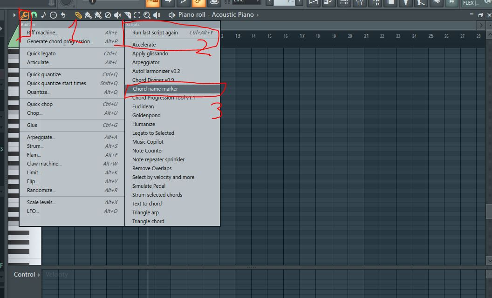
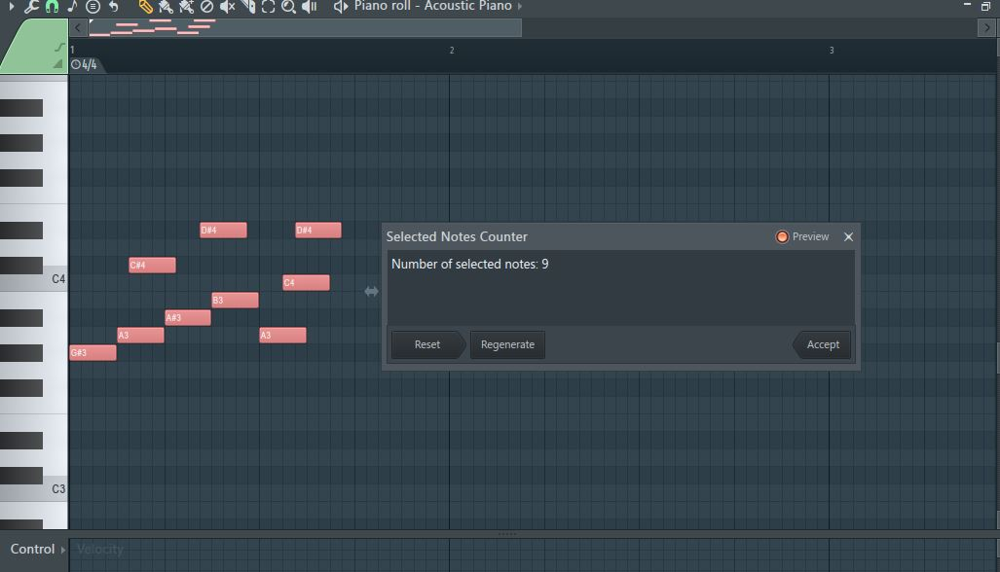

## What script do? 
Piano roll tools let you use a custom script to manipulate the piano roll. 

If you have used Quantizer (Alt+Q), Quick Legato (CTRL+L), these are built in scripts developed by ImageLine. 

<details>
<summary>Finding personal scripts</summary>

</details>

<details>
<summary>Example: Note counter</summary>


```python
## noteCounter.pyscript

import flpianoroll as flp

def createDialog():
    # Count the number of selected notes
    count = 0
    for n in range(flp.score.noteCount):
        note = flp.score.getNote(n)
        if note.selected:
            count += 1
            
    # Create the dialog with the count message
    title = "Selected Notes Counter"
    description = f"Number of selected notes: {count}"
    form = flp.ScriptDialog(title, description)
    return form

def apply(form):
    # This function is called when the dialog is closed by the user
    # No action is needed as we're only displaying information
    pass
```
</details>


## How do I make my own script? 
- Look for the directory containing piano roll scripts. Typically `C:/Program Files/Image-Line/FL Studio 2024/System/Config/Piano roll scripts/`
- Create a `.pyscript` file with the script logic
- `CTRL+S` and it should update to your FL piano roll scripts options.
- So far, debugging can only be done from the DAW by selecting the script and attempt to run it. 


## Example scripts
I've already developed quite a number of them. Why not go through these list? 

<details>
<summary>Show list of scripts</summary>
- https://www.youtube.com/watch?v=PpWtbYhK7Cw
- https://www.youtube.com/watch?v=iRPDYdFFfcg&t
- https://www.youtube.com/watch?v=P3-hvvGlMZQ
- https://www.youtube.com/watch?v=3WDomLuY3T0
- https://www.youtube.com/watch?v=OsAzw_r9aBk
</details>