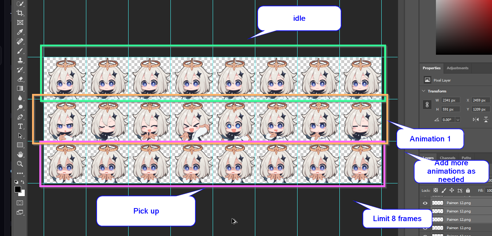

import React from 'react';
import ReactPlayer from 'react-player';


:::info Animation? I'm here to learn music production!

Yeah, who cares. I think animation and kawaii chibi pics are cool.
:::

## What's Fruity Dance
A plugin that creates FL-chan to dance to your sick beats and consumes unnecessary computing capacity from your already-overloaded computer.

## Video guide
<ReactPlayer
  url='https://www.youtube-nocookie.com/watch?v=M7BAk5H5ahQ'
  controls
  width="100%"
/>

---
## How do I make my own FL-chan? 
:::success Rules for animation
1. Only 8 frames per animation
2. Last row of animation is for "Hold" animation
3. Txt file name must be equal to the PNG file name containing spritesheet 
4. Txt file must have the correct Bitmap. 
:::

<details>
<summary>Spritesheet guide</summary>

</details>

### Must have 8 frames per animation 
From Fruity Dance spritesheet example, you see a sequence of 8 sprite pictures. Animation sequence goes from left to right. 

Each row of sprites is a different animation. From example video, you notice I made a mistake of overflowing the sprite, resulting a small part of the sprite "leaking" to the next animation. 


### Last row of animation is for "Hold" animation
Basically, the animation that triggers when clicking the sprite. Use the same sequence of sprite so no animation plays. Or you rather have an animation, up to you. 

### TXT filename = PNG spritesheet filename
Spritesheet should be a PNG file with instructions stated above. To play different animation correctly, in the same directory there should be a text file with the same name as the PNG file. 

The text file should contain the animation sequence. Example: 
```
# spriteSheetName.txt

idle << Default animation
animation1 << Sequence of sprites 1
animation2 << Sequence of sprites 2

... << all other animations you have within spritesheet

hold << Animation never plays until you click on the sprite
```
Without stating the obvious, this an example of ACTUAL CONTENTS in `spriteSheetName.txt`.
```
idle
animation1
animation2
hold
```

### TXT file must have the correct Bitmap
Basically, if your spritesheet has 5 rows, then the TXT file must also have 5 rows.

---
