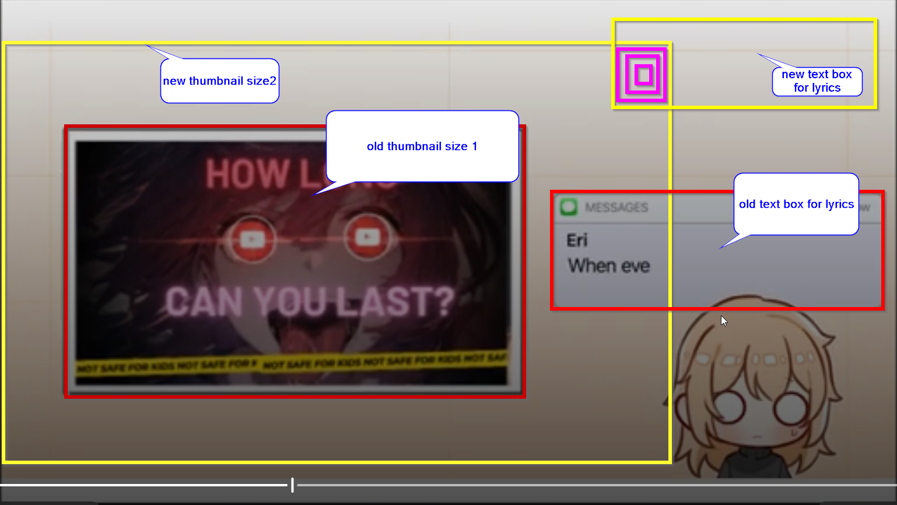
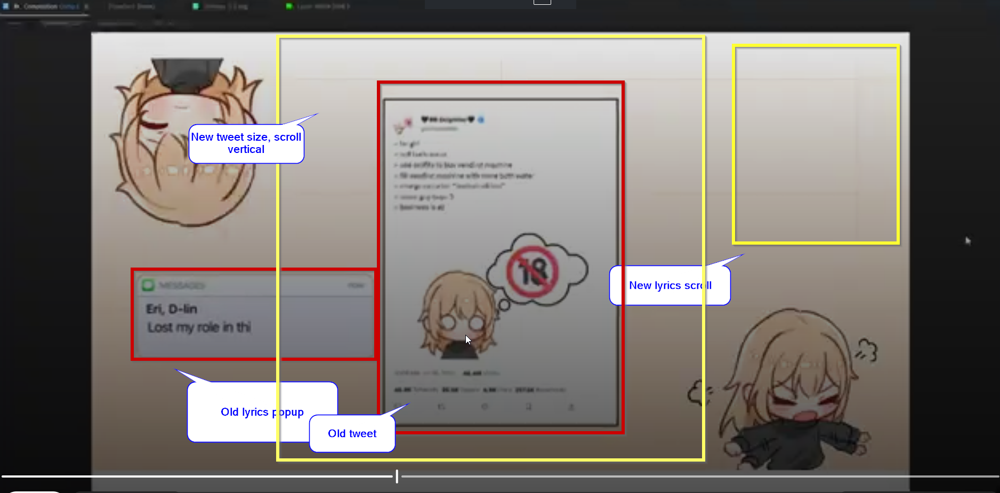
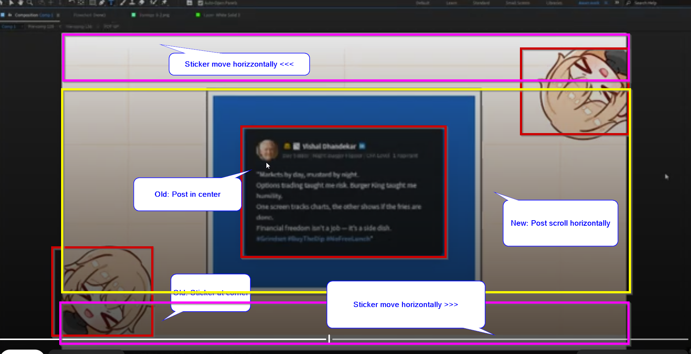

Nothing is perfect at first try. We want to have clarity on revisions so save everyone's sanity. Here are some things I learned from my experience with editors that make revisions a breeze. 

If you are a producer, you can take some ideas. If you are an editor, you can forward some of our practices to your employer. 

Editor's guide

:::info
- Red boxes indicate old work
- Yellow boxes indicate expected work 
- Purple / other boxes indicate new work
- Add comments for clarity
:::

:::warning Tools used
- [Greenshot](https://getgreenshot.org/) (screenshot tool)
:::